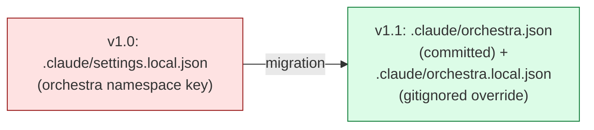

# ADR-001: Orchestra config storage location

> **Doc ID:** ADR-001-orchestra-config-storage
> **Date:** 2026-05-06
> **DRI:** Hassan Mohiddin
> **Status:** Approved
> **OKR Alignment:** v1.1 ship — orchestra plugin must onboard new users without manual config.

## Context

Orchestra v1.0.0 reads its config from `.claude/settings.local.json` under an `orchestra` namespace key (see `orchestra/skills/design-docs/SKILL.md` lines 18-36). This location has three problems:

1. **Personal-only by default.** `.claude/settings.local.json` is gitignored by Claude Code convention. Team-mode users cannot share orchestra config across the team without manually committing a gitignored file (anti-pattern).
2. **Conflicts with non-orchestra settings.** Other plugins, skills, or Claude Code itself may write to `settings.local.json`. Orchestra's config block can be overwritten or merge-conflicted.
3. **Discoverability.** A new user opening the repo sees no orchestra-specific file at the top of `.claude/`. Onboarding requires reading SKILL.md to learn config exists at all.

v1.1 introduces a setup wizard (`orchestra:design-docs:init`) that writes config on behalf of the user. The setup wizard needs ONE canonical config path it can write to and read from. The path must support team mode (commit-by-default) and personal overrides (gitignored escape hatch). Settings.local.json fails the team-mode requirement.

Industry precedent: every config-file-driven dev tool ships its own dedicated file (`.eslintrc.json`, `.prettierrc.json`, `tsconfig.json`, `package.json`, `pyproject.toml`). Sharing a generic settings file with other tools is the exception, not the norm.

## Decision

> **Orchestra stores its config at `.claude/orchestra.json`, committed by default, with `.claude/orchestra.local.json` as a gitignored personal override.**

### Detailed shape

- **Primary file:** `.claude/orchestra.json` — committed to repo by default. Schema: `version`, `orchestra.mode`, `skills.<skill-name>.<config>`. Schema URL hosted at `https://raw.githubusercontent.com/hassan-mohiddin/orchestra/main/schema/orchestra.config.v1.1.json`.
- **Override file:** `.claude/orchestra.local.json` — gitignored. Same schema, deep-merge over primary. Used for per-machine/personal mode flips, debugging, or contracting-gig overrides.
- **Migration:** Existing v1.0 installs detected via `.claude/settings.local.json` orchestra block → user prompted to migrate → v1.0 fields copied to v1.1 schema → v1.0 block left in place (no destructive removal until user confirms).

Lint validates against primary; warns when override diverges materially (e.g., different `mode`).

## Consequences

### Positive

- Team-mode users get committed-by-default config = deterministic CI + onboarding ("clone repo, run orchestra:init OR clone repo, config already present").
- No conflicts with other plugins writing to `settings.local.json`.
- Discoverable — single file at top of `.claude/`, name = self-documenting.
- Schema versioning trivial (`version` field bumps independently of Claude Code settings).
- Personal overrides preserved via `.local.json` escape hatch (industry-standard pattern matching `.env` / `.env.local`).

### Negative

- Two-file system slightly more complex than single-file. Lint must merge correctly + warn on divergence.
- Migration burden for v1.0.0 users (one-time prompt; auto-handled).
- One more file in `.claude/` directory (low cost — Claude Code conventions allow plugin-specific files there).

### Neutral / commitments

- Orchestra owns the file. Schema changes follow semver — `version` field increments on breaking changes. Migration code lives in `cli/migrate.py` (v1.2 module).
- Team-mode default = commit. Solo users can gitignore `orchestra.json` if they want personal-only config (orchestra:init prints reminder during init).
- All future orchestra skills (workflow, tasks, gates, plans in v2.0) nest under `skills.<name>` in the same file. Single config truth.

## Alternatives Briefly Rejected

| Option | Why rejected |
|---|---|
| Stay at `.claude/settings.local.json` | Gitignored by default — fails team mode requirement; conflicts with other plugins; not discoverable. |
| `.claude/settings.json` (committed) | Conflicts with non-orchestra settings; orchestra config drowns in unrelated keys; merge conflicts likely on shared file. |
| `orchestra.config.json` at repo root | Pollutes repo root; not where Claude Code conventions place plugin config; unfamiliar location. |
| `pyproject.toml` `[tool.orchestra]` section | Tied to Python — orchestra targets non-Python repos too (frontend, infra, multi-language). Tool coupling. |
| `package.json` `orchestra` key | Same Python issue inverted — JS-coupled. |
| Per-skill config files (`design-docs.config.json`, `workflow.config.json`) | Fragmentation. v2.0 has 5+ skills → 5+ config files = sprawl. Single file with nested keys is simpler. |

## Related Documents

- Supersedes: (none — first orchestra ADR)
- Superseded by: (none yet)
- Related:
  - `orchestra-dev/features/001-design-docs-init.md` — implements this config schema
  - `orchestra-dev/design/orchestra-philosophy.md` — Key Decisions table references this ADR

## Changelog

| Date | Change |
|---|---|
| 2026-05-06 | Initial draft — Status: Draft. |
| 2026-05-06 | Approved alongside LLD-001. Status → Approved. Will transition to Implemented when v1.1 ships. |
