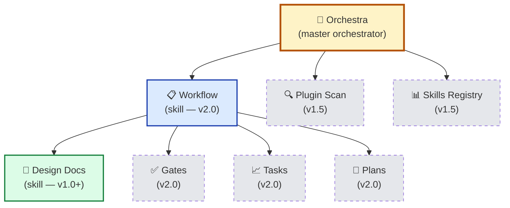
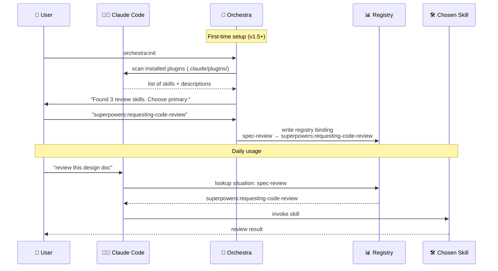
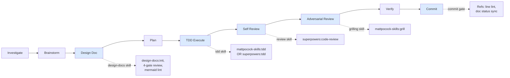

# Orchestra — Philosophy & Brand Design Doc

> **Doc ID:** orchestra-philosophy
> **Date:** 2026-05-06
> **DRI:** Hassan Mohiddin
> **Type:** Design Doc (living)
> **Status:** Current
> **Last Updated:** 2026-05-06
> **Version:** 1.0

---

## Overview

Orchestra is the master orchestrator for Claude Code plugins and skills. It resolves conflicts when users have multiple plugins installed (superpowers, mattpocock-skills, gsd, etc.), keeps a project-specific registry of which skill handles which situation, and provides general-purpose discipline (doc-driven dev, workflow gates, formal vocabulary) that works whether the user has companion plugins or not.

**Vision (one sentence):** Make Claude Code's plugin ecosystem coherent — by orchestrating skills, not replacing them.

**Tagline candidates** (for README + marketing):
- "Master orchestrator for Claude Code skills."
- "The plugin that makes other plugins work together."
- "Discipline as a service for AI engineering."
- "Industry-grade docs, workflow, and skill orchestration in one plugin."

---

## Problem We Solve

Three distinct pains converge in one solution.

### 1. Plugin chaos in Claude Code (2026)

Claude Code's plugin ecosystem grew quickly. By mid-2026, a typical power-user repo has 5+ plugins installed: superpowers, mattpocock-skills, gsd, fullstack-dev, ci-cd toolkits, language-specific helpers, etc. Each plugin ships dozens of skills. Many plugins overlap — two CI/CD skills, three "code review" skills, multiple "debug" approaches.

Users face:
- **Conflict ambiguity** — which skill should handle "review this PR" when 3 plugins offer that situation?
- **Discovery burden** — what's installed, what's enabled, what's superseded?
- **Manual config** — users hand-author registry files like `.claude/skills-registry.md` to map situations → skills.
- **Drift** — install a new plugin, forget to update the registry, agent picks wrong skill.

### 2. Doc-driven dev gap

Most Claude Code plugins ship skills but no discipline scaffolding. Users get tools without process. Industry research shows the highest-ROI software practices are:
- Architecture Decision Records (Michael Nygard, Cognitect 2011)
- Postmortems / blameless incident reviews (Google SRE)
- Living architecture docs (C4 model, Simon Brown)
- Conventional Commits with `Refs:` traceability

These are practices, not tools. A plugin that ships templates without enforcement = decoration. Orchestra ships templates AND enforcement (lint CLI, commit gates, spec review).

### 3. Setup-as-cliff problem

Plugins assume a "ready" repo. Fresh repos have no `docs/` directory, no `STANDARDS.md`, no config. User installs plugin → asks for first design doc → plugin has nowhere to write. Plugin appears broken on first contact. Adoption stalls.

Orchestra solves all three with a single coherent product.

---

## Solution Architecture

### Hierarchy

Orchestra is composed of three layers. Each layer has clear responsibilities and stable APIs across versions.



**Responsibilities:**

| Layer | Owns | Status |
|---|---|---|
| Orchestra | Plugin ecosystem coherence, registry, conflict resolution, install scope guidance | Skeleton in v1.1, full in v1.5 |
| Workflow | End-to-end pipeline (investigate → brainstorm → design → plan → execute → review → verify → commit) composing other skills | v2.0 |
| Design Docs | Typed doc templates, 4-gate spec review, lint, commit gate, mermaid validation | v1.0 (live) → enhanced v1.1 |

### Plugin orchestration model

When a user installs orchestra alongside other plugins, orchestra builds a project-specific registry mapping situations (e.g., "spec review", "TDD execution", "debug") to the chosen skill. The registry is the binding layer between situation-language workflows and concrete skill names.



**Key insight:** Orchestra does not REPLACE other plugins. It ROUTES to them. Superpowers/mattpocock/gsd remain the implementation; orchestra is the conductor.

### Workflow composition (v2.0 preview)

Each skill brings its own discipline (CI rules, commit strategy, lint). Workflow stitches them into one umbrella pipeline.



Each `-.->` line = orchestra routing to whichever skill is bound to that situation in the registry. If none bound → orchestra falls back to its own general-purpose discipline (less specific but functional).

---

## Generalizability Principle

**Orchestra works alone OR with companion plugins.**

This is the central design principle. It dictates every architectural choice:

1. **Situation language, not skill names.** Workflow files reference "spec review", "TDD execution", "adversarial review" — never `superpowers:X`. The registry binds situations → skills. Plugin changes don't break workflows.
2. **Empty registry = self-contained.** If no plugins are installed beyond orchestra, every situation falls back to orchestra's built-in discipline. Less specialized than companion plugins but always works.
3. **Progressive disclosure.** When orchestra detects a relevant skill is installed-but-disabled or not installed, it suggests: "Found `fullstack-dev` skill — enable it for richer guidance on this task?" Doesn't force; offers.
4. **Plugin manifest contract (v1.5+).** Orchestra publishes an `orchestra.json` spec for plugin authors. Plugins that opt in declare categories, alternates, conflicts. Orchestra orchestrates them better. Plugins that don't opt in still work via heuristic analysis.

**Anti-pattern orchestra avoids:** lock-in. Orchestra never becomes the only viable workflow plugin. Users can switch to pure superpowers or pure mattpocock anytime — orchestra's value is composition, not capture.

---

## Differentiation

| Plugin | Primary value | Orchestra relationship |
|---|---|---|
| **superpowers** (obra) | Comprehensive skill library: brainstorming, TDD, debugging, code review, etc. | **Companion** — orchestra routes to superpowers skills via registry. |
| **mattpocock-skills** | Highly opinionated workflow + grilling sessions + docs | **Companion** — orchestra routes to mattpocock skills (esp. grill-with-docs for brainstorm). |
| **gsd (Get Shit Done)** | Task tracking + execution discipline | **Companion** — orchestra workflow can route TaskCreate situations to gsd. |
| **caveman** | Compressed agent output style | **Orthogonal** — affects output style, not workflow shape. Both can run together. |
| **Orchestra** | Plugin orchestration + general-purpose discipline that works alone or composed | **Master orchestrator** — sits above the others, routes to them. |

**Differentiation in one paragraph (for README, marketing posts):**

> Other plugins ARE skills. Orchestra orchestrates them. Install orchestra alone for industry-grade doc discipline (typed docs, 4-gate spec review, commit gates, mermaid validation). Install orchestra alongside superpowers, mattpocock-skills, or gsd, and orchestra builds a project-specific registry that routes every situation to the right skill — resolving conflicts, suggesting installs, keeping itself in sync as your toolkit grows. The plugin that makes other plugins work together.

---

## Mode System

Orchestra has two modes that change behavior across all skills:

### Solo mode (default)

- Single decision-maker (founder, sole maintainer, contractor)
- ADR `OKR Alignment` field optional
- No reviewer-assignment workflow
- RFC vocabulary suppressed (decisions are RECORDED, not DELIBERATED — see Formal Vocabulary section)
- Faster paths: skip team-coordination steps

### Team mode

- 2+ senior engineers (industry threshold per Pragmatic Engineer)
- ADR `OKR Alignment` field MANDATORY (lint-enforced)
- Spec review can assign reviewers
- Plugin manifest spec (v1.5+) supports per-team conflict resolution
- ADR-only vocabulary preserved (no RFC introduction in v1.1; revisit at v2.0 if team mode users demand it)

**Mode is sticky per project.** Set during `orchestra:init`, stored in `.claude/orchestra.json` `orchestra.mode`. Mid-project transitions use `python -m cli.migrate --solo-to-team` (v1.2).

**Why this matters:** solo founders building toward a team future deserve the SAME formal discipline that company engineers use. Mode governs ergonomic differences (mandatory vs optional fields), not philosophical differences (formal vocab is universal).

---

## Formal Vocabulary

**Industry-standard terminology is part of the discipline.**

Solo developers using orchestra deserve to feel professional. Calling an ADR "decision" or a Bug Report "writeup" loses cultural weight, search/transferability, and the gravitas that helps a solo founder feel they're working at company-grade quality.

**Enforced terms (cannot be renamed to informal aliases):**

| Canonical | Allowed formal renames | Rejected informal |
|---|---|---|
| Architecture Decision Record (ADR) | Decision Record, Architecture Decision | "decision", "doc" |
| Bug Report | Incident Report (when severity warrants) | "ticket", "writeup" |
| Postmortem | Retrospective, Incident Postmortem | "review", "lessons" |
| Feature LLD | Tech Spec, Engineering Design, Spec, Design Brief | "spec sheet", "writeup" |
| Implementation Plan | Engineering Plan | "plan doc", "todo list" |
| Runbook | Operations Runbook | "guide", "playbook" |

In `subset-rename` mode, design-docs:init validates rename targets against this whitelist. In `full-custom` mode, agent enforces TitleCase + ≥2 word phrasing as a heuristic for formality.

**Why this matters:** when a solo founder writes their first ADR using orchestra, the doc that lands in `docs/adr/ADR-001-...` reads exactly like the ADRs that ship in Google's, Spotify's, or Cognitect's open-source repos. Cultural transfer is real.

---

## Roadmap Vision

Orchestra ships in tracks. Each version is independently shippable; positioning evolves with capability.

```mermaid
gantt
    title Orchestra Roadmap (2026)
    dateFormat YYYY-MM
    axisFormat %b %Y

    section v1.x
    v1.0 — design-docs skill (live)         :done, v10, 2026-05, 1d
    v1.1 — design-docs:init + setup         :active, v11, 2026-05, 14d
    v1.2 — solo→team migration + Tier 2 viewing :v12, after v11, 14d
    v1.3 — Orchestra-flavored doc browser   :v13, after v12, 21d

    section v1.5 (positioning shift)
    Plugin scan + registry generation       :v15, after v13, 42d
    Plugin manifest spec for authors        :v15b, after v13, 42d
    Conflict resolution UX                  :v15c, after v13, 42d

    section v2.0 (relaunch)
    orchestra:workflow skill                :v20, after v15, 63d
    README rewrite + relaunch               :v20b, after v15, 63d
```

**Strategic positioning by version:**

- **v1.0–v1.3** — orchestra is "doc-skill that also has CLI tooling." Marketing emphasis on doc discipline.
- **v1.5** — orchestra rebrands as "master orchestrator for Claude Code skills." Plugin scan + registry are the differentiator. README rewrite candidate.
- **v2.0** — orchestra delivers full workflow composition. Relaunch with announcement posts. Registry mature, plugin manifest spec stable.

**Anti-pattern avoided:** marketing-before-substance. The v1.5 positioning shift waits until plugin orchestration actually works. Don't repeat earlier launch where positioning preceded capability.

---

## Brand Voice & Positioning

### Voice

- **Opinionated, not configurable.** Orchestra is `git init` for AI engineering — you adopt the discipline or you don't use the tool. No skip-paths for invariants (lint, commit gates, status lifecycle, mermaid validation). Customization is on the SURFACE (paths, doc-type names, optional add-ons), never the CORE.
- **Industry-grounded.** Every decision cites a source: Michael Nygard for ADR, Google SRE for postmortems, Pragmatic Engineer for solo/team threshold, Conventional Commits for commit gate. Orchestra is research-derived, not invented.
- **Solo-aware, team-ready.** Solo founders and small teams are the primary audience. Mid-size teams are an upgrade path. Enterprise is not the target.
- **Cross-tool by default.** AGENTS.md + llms.txt support means orchestra docs work for Claude, Gemini, Cursor, Copilot, future agents. Not a Claude-only product.

### Positioning vs alternatives

| Alternative | What they do | Why orchestra is different |
|---|---|---|
| Hand-rolled `docs/` + manual discipline | Markdown templates in a repo | No enforcement (lint, commit gate, spec review). Relies on developer memory. |
| Notion / Confluence | Centralized doc tools | External to git. No code-coupling. No lint/CI integration. |
| Plain superpowers / mattpocock | Skill libraries | No orchestration layer. User manually composes. No registry. |
| Custom slash commands per project | Per-repo workflow scaffolding | Doesn't compose with installed plugins. Reinvents wheel per project. |

Orchestra's positioning is the gap none of these fill: **a discipline-first, plugin-composing layer that grows with the ecosystem instead of fighting it.**

---

## README Source Material

This section captures every "rememberable" the user has flagged for inclusion in the public README. When writing the README, source from this section directly.

### Install scope guidance (from 2026-05-06 brainstorm)

```markdown
## Installation

**Solo dev / personal use:** install user-scoped — runs across all projects.
  /plugin install orchestra@orchestra

**Team / shared repo:** install project-scoped — commit `.claude/settings.json` with
orchestra pinned. Every contributor + every CI gets the same version, deterministic
doc gates everywhere.

**Local override (rare):** `.claude/settings.local.json` for personal overrides on top
of project config. Not recommended for orchestra itself — orchestra is foundational, not
experimental.

**Strategic pick:**
- Solo founder, multiple projects, same disciplines → user scope
- Team with shared repo, deterministic CI → project scope + version-pin
- Edge case (contracting gig with different conventions) → project scope to override
```

### One-paragraph pitch

> Orchestra is the master orchestrator for Claude Code plugins and skills. Install it
> alone for industry-grade doc discipline (typed docs, 4-gate spec review, commit gates,
> mermaid validation). Install it alongside superpowers, mattpocock-skills, or gsd, and
> orchestra builds a project-specific registry that routes every situation to the right
> skill — resolving conflicts, suggesting installs, keeping itself in sync as your toolkit
> grows. The plugin that makes other plugins work together.

### Quick-start (for README later)

```markdown
## Quick start

1. Install:
   /plugin install orchestra@orchestra
2. In your project, ask Claude:
   "Set up orchestra in this repo"
3. Answer 3 prompts (mode / doc-types / optional add-ons)
4. Done. Ask for your first design doc:
   "Create a feature LLD for X"
   → orchestra writes it, lints it, asks you to spec-review it, commits it.
```

### FAQ entries (for README later)

- **Q: Do I need superpowers / mattpocock to use orchestra?**
  A: No. Orchestra ships its own general-purpose discipline. Companion plugins make it sharper.

- **Q: Will orchestra conflict with my existing skills-registry.md?**
  A: v1.5+ — orchestra reads existing registries during init and offers to merge. v1.1 — registry generation is not yet active.

- **Q: Can I disable orchestra's invariants (lint, commit gates)?**
  A: No. Invariants are the product. Customization is on the surface (paths, doc-type names). If you need a configurable doc framework, orchestra is the wrong tool.

- **Q: Solo vs team mode — when do I switch?**
  A: When you have 2+ senior engineers (industry threshold per Pragmatic Engineer). Run `python -m cli.migrate --solo-to-team` (v1.2+).

- **Q: How do I view mermaid diagrams?**
  A: GitHub renders natively. VS Code: install "Markdown Preview Mermaid Support". Ad-hoc: paste at mermaid.live. Offline export: `npx -y @mermaid-js/mermaid-cli -i doc.md`.

### Industry citations (for README "Built On" section)

- **Michael Nygard** — *Documenting Architecture Decisions* (Cognitect, 2011) — ADR pattern
- **Google SRE Book** — *Postmortem Culture: Learning from Failure* — blameless postmortems
- **Pragmatic Engineer** — *RFCs and Design Docs* — solo/team threshold + ADR vs RFC distinction
- **Linux Foundation Agentic AI Foundation** — AGENTS.md spec
- **Jeremy Howard / Answer.AI** — llms.txt spec (llmstxt.org)
- **Conventional Commits** — conventionalcommits.org/v1.0.0
- **Simon Brown** — C4 model for architecture diagramming
- **rvdbreemen/adr-kit** — 4-gate review pattern adapted

### Anti-pitch (what orchestra is NOT)

- **Not a documentation generator.** Orchestra doesn't auto-write docs from code. Authors write; orchestra enforces.
- **Not a Notion/Confluence replacement.** Orchestra docs live in git, version-controlled, code-coupled.
- **Not a workflow framework.** Orchestra composes existing workflow plugins (superpowers/mattpocock); doesn't invent its own.
- **Not enterprise-targeted.** Orchestra optimizes for solo + small team. Enterprise scale (50+ engineers, multiple business units, audit requirements) is out of scope.

---

## Key Decisions

ADRs that will record orchestra's foundational architectural decisions. Linked here as they are written.

| ADR | Decision | Path | Status |
|---|---|---|---|
| ADR-001 | Config storage: `.claude/orchestra.json` (committed) over `.claude/settings.local.json` | `orchestra-dev/adr/ADR-001-orchestra-config-storage.md` | Implemented 2026-05-06 |
| ADR-002 | Module layout: flat `cli/<module>` (no `orchestra/` Python package) | TBD | TBD if v1.1 implementation surfaces ambiguity |
| ADR-003 | Mermaid lint reuses existing `extract_mermaid.py` (no duplication) | TBD | Optional — covered in LLD-001 |
| ADR-004 | Plugin manifest spec (`orchestra.json` for plugin authors) | TBD | v1.5 work |
| ADR-005 | RFC vocabulary stance — ADR-only across both modes | TBD | Optional — covered in this Design Doc |

This list grows as orchestra evolves. Each ADR records a forcing decision that future maintainers (or future Hassan) shouldn't have to re-derive.

---

## Changelog

| Date | Change |
|---|---|
| 2026-05-06 | Initial Design Doc — Status: Current. Synthesizes 2026-05-06 brainstorm session (Q1–Q7) + LLD-001 positioning decisions. Mirrored to `orchestra/docs/design/orchestra-philosophy.md`. |
| 2026-05-06 | Sync after ADR-001 approved + roadmap doc landed: gantt durations updated for v1.5 (30d → 42d, 6 weeks per roadmap) and v2.0 (45d → 63d, 9 weeks per roadmap). Key Decisions row for ADR-001 marked Approved 2026-05-06. Status remains Current. |
| 2026-05-06 | v1.1 shipped (LLD-001 → Verified). 53 pytest tests + 5/5 eval scenarios green. Plugin version bumped 1.0.0 → 1.1.0. ADR-001 row updated: Approved → Implemented. Status remains Current. |
| 2026-05-06 | v1.2 shipped (LLD-002 → Verified). 75 pytest tests + 8/8 eval scenarios green. Plugin version bumped 1.1.0 → 1.2.0. New CLI: cli.migrate (solo↔team), cli.viewer (Tier 2 mermaid export), cli.install_hooks --commit-msg. Status remains Current. |
| 2026-05-06 | v1.3 shipped (LLD-003 → Verified). 85 pytest tests + 10/10 eval scenarios green. Plugin version bumped 1.2.0 → 1.3.0. New CLI: cli.viewer install-mkdocs / build / publish-gh-pages. Tier 3 doc browser via MkDocs Material. Status remains Current. |
