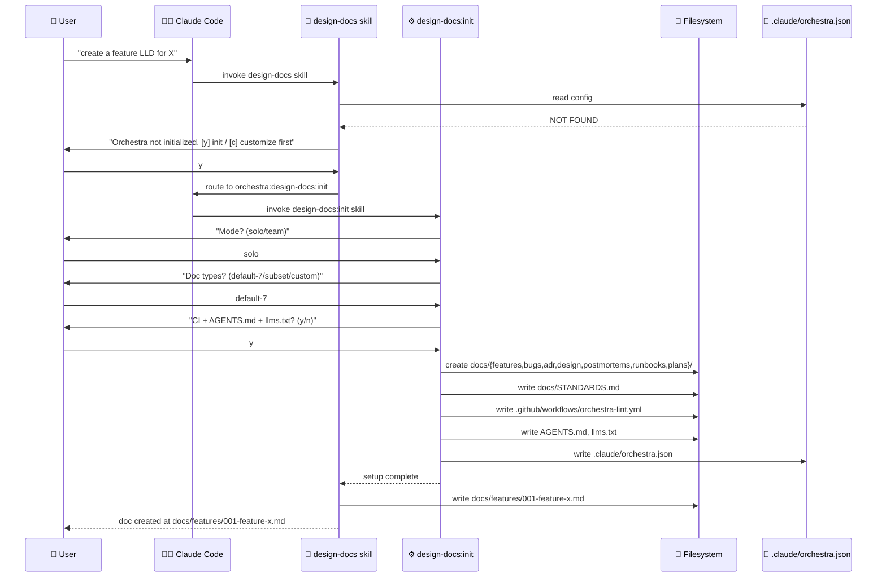
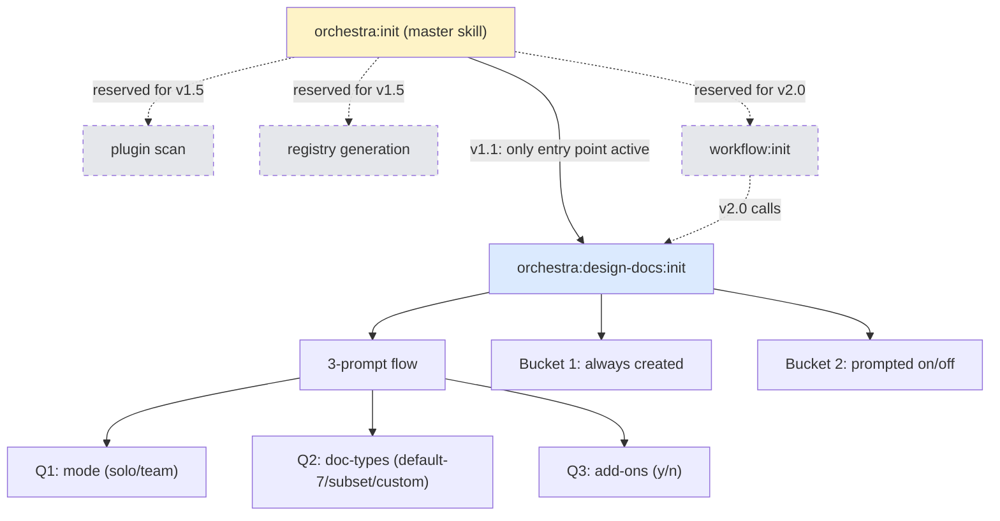

# Feature: orchestra v1.1 — design-docs:init skill + supporting infrastructure

> **Doc ID:** 001-design-docs-init
> **Date:** 2026-05-06
> **DRI:** Hassan Mohiddin
> **Type:** Feature LLD
> **Status:** Verified

## Problem Statement

Orchestra v1.0.0 ships the `orchestra:design-docs` skill as inert text. A user installs the plugin into a fresh repo, asks Claude to "create a design doc", and the skill has nowhere to write — no `docs/` directory, no `STANDARDS.md`, no config. The plugin appears broken on first contact.

Three concrete failures verified in v1.0.0:

1. **No scaffolding step.** Skill assumes `docs/{features,bugs,adr,…}/` exists.
   - Evidence: `orchestra/skills/design-docs/SKILL.md` line 24-32 references `doc_paths` like `docs/features` but skill never creates them.
   - Evidence: `orchestra/skills/design-docs/scripts/next_doc_number.sh` line 1 (existing) calls `ls docs/features/*.md` which fails on missing dir.

2. **No config schema.** Skill expects `.claude/settings.local.json` orchestra config block (`orchestra/skills/design-docs/SKILL.md` line 18-36) but provides no init command to create it. Users must hand-author JSON or accept hardcoded defaults.

3. **No mermaid validation in lint pipeline.** `orchestra/cli/lint.py` lines 1-50 (read 2026-05-06) define lint rules for Refs/metadata/status/required-sections only. Mermaid block validation exists separately in `orchestra/skills/design-docs/scripts/extract_mermaid.py` (line 19, `--validate` flag) but is NOT wired into pre-commit. Broken mermaid surfaces only at GitHub render time.

Without v1.1, orchestra cannot onboard a new user without manual repo setup. This blocks adoption — the marketplace listing (`https://github.com/anthropics/claude-code-marketplace`, submitted 2026-05-06) and announcement post drafts (previously at `.announce/post-drafts.md`, removed in commit b4be823 for cleanup) point to a plugin that doesn't work out of the box.

## Success Criteria

- [ ] Fresh repo + `/plugin install orchestra@orchestra` + first design-doc request → auto-prompt fires, init runs, doc written to correct path with no manual scaffolding
- [ ] `orchestra:init` skill exists and delegates to `design-docs:init` (stable user-facing API for v1.5+ plugin scan addition)
- [ ] `design-docs:init` 3-prompt flow (mode / paths / add-ons) writes idempotent setup; rerun = no-op without `--force`
- [ ] `.claude/orchestra.json` config schema validated; `cli/lint.py` reads from it; `orchestra:design-docs` skill reads from it (replaces today's `.claude/settings.local.json` orchestra block)
- [ ] Custom doc-types mode (subset-rename + full-custom) generates project-specific `STANDARDS.md` enforcing orchestra invariants (formal vocab, status lifecycle, changelog, mermaid minimums per `orchestra-dev/STANDARDS.md` lines 226-238)
- [ ] `cli/lint.py --mermaid` extracts mermaid blocks and validates via `npx @mermaid-js/mermaid-cli` if available; graceful fallback to syntax-only check
- [ ] Pre-commit hook installer (`python -m cli.install_hooks`) writes `.git/hooks/pre-commit` invoking `python -m cli.lint --pre-commit`
- [ ] v1.0.0 → v1.1 migration: existing installs auto-prompt init on first design-docs invocation (no breaking change)
- [ ] 5+ eval scenarios pass (fresh-init, custom-mode, rerun-idempotent, missing-setup-prompt, mermaid-lint)
- [ ] Tier 1 mermaid viewing docs in `orchestra/README.md` (GitHub native, VS Code extension, mermaid.live, npx mermaid-cli)

## Scope

### In Scope

- New skill: `orchestra:init` (skeleton — delegates to design-docs:init only in v1.1; reserved for plugin scan in v1.5)
- New skill: `orchestra:design-docs:init` (3-prompt setup flow)
- Hybrid auto-prompt: design-docs skill detects missing `.claude/orchestra.json` → user-facing 2-option prompt (`y` = run init / `c` = customize first); CC-side flow then invokes `orchestra:design-docs:init`
- Setup scope:
  - **Bucket 1 (always created):** `docs/` root + 7 subdirs (`features`, `bugs`, `adr`, `design`, `postmortems`, `runbooks`, `plans`) + `docs/STANDARDS.md` + `.claude/orchestra.json` + `.gitignore` append. The 7 dirs match `orchestra/skills/design-docs/SKILL.md` lines 24-32 doc_paths schema.
  - **Bucket 2 (prompted on/off):** `.github/workflows/orchestra-lint.yml`, `AGENTS.md`, `llms.txt`, `docs/adr/DECISIONS.md`
- Custom doc-types mechanics:
  - `default-7` (no customization)
  - `subset-rename` (drop unused + rename to formal alternatives)
  - `full-custom` (define new types — agent enforces invariants)
- Idempotency: skip-existing default + `--force` flag
- Config storage: `.claude/orchestra.json` (committed) + `.claude/orchestra.local.json` (gitignored override)
- Mermaid lint integration into `cli/lint.py` (consumes existing `extract_mermaid.py` parser, does NOT duplicate it)
- Pre-commit hook installer at `cli/install_hooks.py`
- v1.0.0 → v1.1 migration handling (auto-prompt for existing installs)
- Mermaid viewing Tier 1 (README.md docs only)
- 5 new eval scenarios

### Out of Scope (deferred to roadmap version)

Roadmap doc to be created at `orchestra-dev/plans/2026-05-06-orchestra-roadmap.md` after this LLD is approved. Versions cited below are roadmap targets, not commitments.

- **v1.2:** Mermaid CLI export tool (Tier 2 viewing); `cli/migrate.py --solo-to-team` migration; `commit-msg` hook for Refs: line check at message authoring time
- **v1.3+:** Orchestra-flavored doc browser (Tier 3 viewing — local server, cross-doc nav)
- **v1.5:** Plugin scanning + skills-registry generation (the `orchestra:init` core feature, scaffolded as skeleton in v1.1 to keep API stable); plugin manifest spec (`orchestra.json` contract for plugin authors); import mode for existing non-orchestra docs
- **v2.0:** `orchestra:workflow` skill (consumes registry, demotes design-docs to sub-component)

Three doc-types from the `orchestra-dev/STANDARDS.md` Doc Types table (Policies row line 22, Research row line 24, Investigation row line 25) are NOT scaffolded in Bucket 1 — created on-demand when first invoked, matching the existing exemption pattern for Postmortems/Runbooks at `orchestra-dev/STANDARDS.md` line 37. Decision rationale: the 7 scaffolded types are required for orchestra philosophy invariants (every project does features/bugs/decisions/architecture/incidents/runbooks/plans). The 3 on-demand types are optional disciplines (not all projects formalize policies, do research, or persist investigation scratch).

## Design

### Architecture / Data Flow



### Skill Architecture



In v1.1, `orchestra:init` is a thin skeleton with only the design-docs:init delegation wired. Plugin scan, registry generation, and workflow:init are reserved branches (dashed lines) that activate in later versions without breaking the user-facing `orchestra:init` invocation contract.

### Config Schema (`.claude/orchestra.json`)

JSON schema is hosted in-repo at `orchestra/schema/orchestra.config.v1.1.json` (to be created in v1.1 implementation). Reference URL uses GitHub raw content:

```json
{
  "$schema": "https://raw.githubusercontent.com/hassan-mohiddin/orchestra/main/schema/orchestra.config.v1.1.json",
  "version": "1.1",
  "orchestra": {
    "mode": "solo"
  },
  "skills": {
    "design-docs": {
      "doc_paths": {
        "features": "docs/features",
        "bugs": "docs/bugs",
        "adr": "docs/adr",
        "design": "docs/design",
        "postmortems": "docs/postmortems",
        "runbooks": "docs/runbooks",
        "plans": "docs/plans"
      },
      "doc_types": {
        "preset": "default-7",
        "renames": {},
        "custom_types": []
      },
      "spec_review_skill": "superpowers:requesting-code-review",
      "ci_workflow_installed": true,
      "agents_md_installed": true,
      "llms_txt_installed": true
    }
  }
}
```

Field reference:

| Field | Type | Values | Notes |
|---|---|---|---|
| `version` | string | `"1.1"` | Schema version. Bumped per major orchestra release with breaking config changes. |
| `orchestra.mode` | string | `solo` \| `team` | Affects ADR `OKR Alignment` field requirement. **Does NOT introduce RFC vocabulary** — orchestra-dev/STANDARDS.md lines 86-88 mandate ADR-only vocabulary across both modes. |
| `skills.design-docs.doc_paths` | object | path map | Override defaults if repo has non-standard layout. |
| `skills.design-docs.doc_types.preset` | string | `default-7` \| `subset-rename` \| `full-custom` | Drives template selection + STANDARDS.md generation. |
| `skills.design-docs.doc_types.renames` | object | `{original: formal-rename}` | Whitelist-validated by design-docs:init at write time. |
| `skills.design-docs.doc_types.custom_types` | array | `[{name, path, naming_pattern, status_enum, required_sections}]` | full-custom only. Each entry validated against orchestra invariants. |
| `skills.design-docs.spec_review_skill` | string \| null | skill name | Default: `superpowers:requesting-code-review`. Null = native LLM performs review. |
| `skills.design-docs.ci_workflow_installed` | boolean | — | Tracks Bucket 2 add-on state for idempotent re-init. |
| `skills.design-docs.agents_md_installed` | boolean | — | Same. |
| `skills.design-docs.llms_txt_installed` | boolean | — | Same. |

### Solo vs Team Mode (clarification)

`orchestra-dev/STANDARDS.md` lines 86-88 specify: "RFC vocabulary is not used — SCALE has a single decision-maker. Re-evaluate if 2+ senior engineers join." Orchestra inherits this stance for both modes:

- **solo mode** — ADR-only vocab. ADR `OKR Alignment` field optional.
- **team mode** — ADR-only vocab (same). ADR `OKR Alignment` field MANDATORY (lint-enforced via `cli/lint.py` REQUIRED_SECTIONS table). No RFC introduction in v1.1.

If a future release adds RFC vocabulary support for team mode, it requires a STANDARDS.md amendment first. Tracked as v2.0 backlog candidate, not v1.1 work.

### File-System Side Effects

Bucket 1 (always written, gated by skip-existing):

| Path | Contents | Notes |
|---|---|---|
| `docs/features/` | `.gitkeep` | Subdirs match `orchestra/skills/design-docs/SKILL.md` line 24-32 schema |
| `docs/bugs/` | `.gitkeep` | |
| `docs/adr/` | `.gitkeep` | |
| `docs/design/` | `.gitkeep` | |
| `docs/postmortems/` | `.gitkeep` | |
| `docs/runbooks/` | `.gitkeep` | |
| `docs/plans/` | `.gitkeep` | |
| `docs/STANDARDS.md` | Generated per `doc_types.preset` (see "STANDARDS.md generation" below) | Project-owned, user can edit |
| `.claude/orchestra.json` | Populated from prompts | Committed |
| `.gitignore` | Append (idempotent grep-and-skip): `.claude/orchestra.local.json`, `docs/investigations/`, `.eval-workspace/` | Append-only — preserves existing rules |

Bucket 2 (only if `[y]` to add-ons prompt):

| Path | Contents |
|---|---|
| `.github/workflows/orchestra-lint.yml` | CI gate calling `python -m cli.lint --range main..HEAD` |
| `AGENTS.md` | Cross-tool AI doc standard pointer to `docs/` |
| `llms.txt` | Root-level LLM nav file |

**Always-run regardless of Bucket 2 prompt:** `docs/adr/DECISIONS.md` — design-docs:init invokes `python -m cli.decisions_index` once during init to seed the empty index (the file is auto-regenerated whenever new ADRs land). Not gated on the add-ons prompt because DECISIONS.md is part of the ADR discipline core, not an optional add-on.

### STANDARDS.md Generation (preset-driven)

`design-docs:init` generates `docs/STANDARDS.md` via three branches:

| `doc_types.preset` | STANDARDS.md source |
|---|---|
| `default-7` | Direct copy of `orchestra/skills/design-docs/STANDARDS.md` from plugin install path. No modifications. |
| `subset-rename` | Copy of plugin STANDARDS.md, then string-substitute renames table (e.g., "Feature LLD" → "Tech Spec") and remove sections for dropped types. |
| `full-custom` | Generated from template skeleton + `custom_types` array. Each custom type emits a "Required Sections Per Doc Type" subsection per orchestra-dev/STANDARDS.md lines 113-219 pattern. |

Mermaid diagram requirements per type follow `orchestra-dev/STANDARDS.md` lines 226-238 explicit minimums (Feature LLD ≥1, Bug Report ≥1, ADR 0-1, Design Doc ≥3, Postmortem ≥1, Runbook 0, Plan 0). Custom types specify their own minimum during full-custom wizard (Q6).

### Custom Mode Mechanics

**Subset-rename flow (interactive, design-docs:init asks):**

```
Default doc types — toggle to keep/drop, optionally rename:
  [x] Feature LLD       [rename → ____]
  [x] Bug Report        [rename → ____]
  [x] ADR               [rename → ____]
  [x] Design Doc        [rename → ____]
  [x] Postmortem        [rename → ____]
  [x] Runbook           [rename → ____]
  [x] Plan              [rename → ____]

User toggles checkboxes + provides renames. design-docs:init validates renames against formal-vocab whitelist:

  ALLOWED whitelist (sourced from industry literature — STANDARDS.md ADR pattern, Pragmatic Engineer naming):
    "Tech Spec", "Engineering Design", "Spec", "Design Brief",
    "Decision Record", "Architecture Decision", "Incident Report",
    "Operations Runbook", "Implementation Plan", "Engineering Plan",
    "Postmortem", "Retrospective"

  NOT in whitelist: "RFC" — orchestra philosophy (orchestra-dev/design/orchestra-philosophy.md "Formal Vocabulary" section + STANDARDS.md lines 86-88) suppresses RFC vocabulary. Decisions are RECORDED (ADR), not DELIBERATED (RFC). Solo + team modes both. Re-evaluate at v2.0+.

  REJECTED: any term not in the whitelist (informal short-forms like "doc", "thing", "writeup", "note")

Whitelist extension: future PRs to orchestra repo can add formal terms; users wanting custom additions must propose upstream OR use full-custom mode.

  → If rejected: design-docs:init prints whitelist + asks user to choose from list or revert to default name.
```

**Full-custom flow (interactive wizard, one type at a time):**

```
For each new type:
  Q1: Type name (must match formal-vocab pattern — TitleCase phrase, ≥2 words preferred, no informal terms)
  Q2: Subdirectory under docs/ (kebab-case, regex ^[a-z][a-z0-9-]*$ — no path traversal)
  Q3: Naming convention — one of three explicit patterns (no free-form):
        - NNN-kebab.md (3-digit zero-padded auto-numbered)
        - YYYY-MM-DD-kebab.md (date-prefixed)
        - kebab.md (free-form name, no number/date)
  Q4: Status enum values (comma-separated, ≥3 states, must include ≥1 terminal state like "Closed/Verified/Implemented/Superseded")
  Q5: Required sections (≥3, MUST include both: "Status" implicit via metadata block, AND "Changelog")
  Q6: Mermaid required? (y/n + minimum diagram count if y)

design-docs:init enforces invariants:
  - Changelog section MANDATORY (preserved across all custom types)
  - Status enum MANDATORY (≥3 states with ≥1 terminal)
  - Refs: line obligation preserved across renames (cli/lint.py validates against renamed type names automatically)
  - Naming convention restricted to 3 patterns above (no free-form)
  - Mermaid minimum from STANDARDS.md table OR explicit user count
```

**STANDARDS.md generation:** `design-docs:init` emits project-specific `docs/STANDARDS.md` per the three preset branches (table above). User can edit post-generation; `cli/lint.py` validates against the project's generated `docs/STANDARDS.md` (not plugin-internal `orchestra/skills/design-docs/STANDARDS.md`).

### Lint Integration (`cli/lint.py --mermaid`)

The lint pipeline (`orchestra/cli/lint.py` lines 1-50, current state) does NOT validate mermaid blocks today. `extract_mermaid.py` (`orchestra/skills/design-docs/scripts/extract_mermaid.py` lines 19-26, existing `--validate` flag) has the validation logic but is invoked manually.

**v1.1 wiring decision: import existing parser into lint pipeline.** Do NOT duplicate `MermaidDiagram` class or extraction regex.

**Python module loading note:** `extract_mermaid.py` currently lives at `skills/design-docs/scripts/` (hyphen in directory name, no `__init__.py` chain). Hyphens are not valid Python identifiers, so a direct `import skills.design-docs.scripts.extract_mermaid` is impossible. v1.1 implementation chooses one of:
- (a) `importlib.util.spec_from_file_location("extract_mermaid", "skills/design-docs/scripts/extract_mermaid.py")` to load by path — preferred (no rename, no `__init__.py` pollution)
- (b) Symlink `skills/design_docs` → `skills/design-docs` + add `__init__.py` files — heavier change, breaks fewer external tools

Decision deferred to v1.1 implementation plan; pseudocode below uses the import-style for readability:

```python
# cli/lint.py — new module-level import (loaded via importlib in actual implementation)
from skills.design_docs.scripts.extract_mermaid import MermaidDiagram, extract_diagrams_from_file

# cli/lint.py — new flag
parser.add_argument("--mermaid", action="store_true",
                    help="Validate mermaid blocks (requires npx + @mermaid-js/mermaid-cli for full check)")

def lint_mermaid_blocks(doc_path: Path) -> list[LintError]:
    """Validate mermaid blocks via existing extract_mermaid.py logic."""
    diagrams = extract_diagrams_from_file(doc_path)  # imported, not redefined
    errors = []

    if shutil.which("npx"):
        for d in diagrams:
            result = subprocess.run(
                ["npx", "-y", "@mermaid-js/mermaid-cli", "-i", "/dev/stdin", "-o", "/tmp/out.svg"],
                input=d.content, capture_output=True, text=True, timeout=30,
            )
            if result.returncode != 0:
                errors.append(LintError(doc_path, d.line_number, "mermaid parse error", result.stderr))
    else:
        # Fallback: existing extract_mermaid.py validation (regex-based balanced checks)
        for d in diagrams:
            errors.extend(d.basic_syntax_check())  # added in v1.1 — signature: MermaidDiagram.basic_syntax_check() -> list[LintError]
        warn_once("npx not found — mermaid validation degraded. No global install required — `npx -y @mermaid-js/mermaid-cli` fetches per-invocation when run.")

    return errors
```

**Default behavior in `--pre-commit` and `--doc <path>` modes:** `--mermaid` runs by default (opt-out via `--no-mermaid`). Reason: catching broken diagrams at commit time is high-value; users who want fast pre-commit can opt out.

**Implementation note:** if `extract_mermaid.py` does not yet expose `extract_diagrams_from_file()` as a callable function (currently CLI-only), v1.1 implementation refactors it to expose the function while preserving CLI behavior. Tracked as a sub-task of the v1.1 plan.

### Pre-commit Hook Installer

New CLI module: `cli/install_hooks.py`. Invocation: `python -m cli.install_hooks`.

Behavior:
1. Detect `.git/hooks/` directory exists. If missing → exit with error "not a git repo".
2. Detect existing `pre-commit` hook. If present → diff against orchestra hook + prompt: append, replace, skip. Default = skip (safest).
3. Write `.git/hooks/pre-commit`:

   ```bash
   #!/usr/bin/env bash
   set -euo pipefail
   python -m cli.lint --pre-commit
   ```

4. `chmod +x .git/hooks/pre-commit`.

Idempotent: rerun without `--force` skips if hook content matches expected. With `--force`: replace unconditionally (destructive).

### v1.0.0 → v1.1 Migration

Existing v1.0.0 installs have:
- Plugin installed at user/project scope
- No `.claude/orchestra.json` (v1.0 used `.claude/settings.local.json` orchestra block — see `orchestra/skills/design-docs/SKILL.md` lines 18-36)
- Possibly hand-created `docs/` (or not)

Migration logic on first v1.1 invocation:

1. design-docs skill loads → checks for `.claude/orchestra.json`.
2. Not found → check for `.claude/settings.local.json` orchestra block (v1.0 config location).
3. If v1.0 block found → "v1.0 config detected. Migrate to v1.1 schema? [y/n]". On `y`, generate `.claude/orchestra.json` from v1.0 fields (mode + doc_paths + spec_review_skill) and add v1.1-only fields with defaults. v1.0 block left in place (no destructive removal until user confirms).
4. If neither v1.1 nor v1.0 config → check for `docs/STANDARDS.md` (sign of pre-existing manual setup).
5. If `docs/STANDARDS.md` exists → "Manual setup detected. Generate v1.1 config from existing structure? [y/customize]". Config generation infers paths from `docs/` subdirs found.
6. If nothing → standard fresh-init prompt fires.

Auto-detection logic preserves user's manual setup; never overwrites existing files.

## API Changes

No HTTP API. Skill + CLI surface.

### Skill API (new)

| Skill | Description | Trigger |
|---|---|---|
| `orchestra:init` | Master init — v1.1 delegates to design-docs:init only | Skill description matches phrases like "set up orchestra", "initialize orchestra in this repo". Encoded in skill frontmatter `description:` field per Claude Code skill resolution. |
| `orchestra:design-docs:init` | Doc-skill setup with 3-prompt flow | Invoked by `orchestra:init` OR by design-docs skill auto-prompt path (user confirms `[y]` → CC routes to this skill) |

### CLI API (new + changed)

| Command | Status | Description |
|---|---|---|
| `python -m cli.lint --pre-commit` | Existing — extended with `--mermaid` default-on | Validate staged docs incl. mermaid |
| `python -m cli.lint --mermaid` | New flag | Explicit mermaid-only validation pass on passed docs |
| `python -m cli.lint --no-mermaid` | New flag | Skip mermaid in modes where it runs by default |
| `python -m cli.install_hooks` | New module | Install `.git/hooks/pre-commit` calling `python -m cli.lint --pre-commit` |
| `python -m cli.init` | New module | Manual init / re-init entry (`--force` to overwrite). Mirrors `orchestra:design-docs:init` skill flow non-interactively when args provided. |
| `python -m cli.decisions_index` | Existing — invoked by design-docs:init during init | Auto-generates `docs/adr/DECISIONS.md` |

All modules use the existing flat `cli/` package (`orchestra/cli/__init__.py` confirmed present 2026-05-06). No top-level `orchestra/` Python package introduced in v1.1.

**Note on existing lint.py docstring drift:** `orchestra/cli/lint.py` lines 4-7 reference `python -m design_docs.lint` which is incorrect (no `design_docs` package exists). v1.1 implementation fixes this docstring to `python -m cli.lint` while wiring `--mermaid`. Sub-task of v1.1 plan.

## Database Changes

Not applicable — file-system + git only.

## Edge Cases & Error Handling

| Scenario | Expected Behavior |
|---|---|
| User runs init in non-git repo | `cli/install_hooks.py` step skipped (no `.git/hooks/`). Other Bucket 1+2 files written. Init prints "git not detected — pre-commit hook installation skipped." |
| User runs init in repo with existing `docs/` from another tool | v1.0→v1.1 migration path fires (sees `docs/STANDARDS.md`). Detect non-orchestra layout, prompt user to map types or start fresh. |
| User runs init twice without `--force` | All Bucket 1+2 files: skip-existing, no error. Prints summary "X files existed, Y created, Z skipped." |
| User picks subset-rename but provides informal rename | design-docs:init rejects rename with whitelist shown. Re-prompts user to pick from whitelist or revert to default name. |
| User picks full-custom but underspecifies invariants (e.g., <3 status states) | design-docs:init re-prompts on the failing question (does NOT silently fill defaults — keeps user in control). |
| `npx` not available for mermaid lint | Graceful fallback to basic syntax check. Warn once per session via `warn_once()`, not per doc. |
| Pre-existing `.git/hooks/pre-commit` | Detect content mismatch + diff. Prompt: append, replace, skip. Default = skip. |
| User edits `.claude/orchestra.json` to invalid JSON | `cli/lint.py` detects on next run via JSON parse. Error includes parse location + suggested fix template. |
| User changes `mode` from solo to team mid-project | Existing ADRs missing `OKR Alignment` field (now mandatory in team mode). `cli/lint.py` flags as errors per existing REQUIRED_SECTIONS enforcement (lint.py lines 43-50 pattern). User backfills manually (no auto-migration in v1.1; deferred to v1.2 `cli/migrate.py`). |
| `.claude/orchestra.local.json` overrides conflict with `orchestra.json` (e.g., different mode) | Local wins. `cli/lint.py` warns if local diverges materially with diff summary. |
| Custom type subdirectory path attempts traversal (`../`) | design-docs:init regex-validates `path` field against `^[a-z][a-z0-9-]*$`; rejects + re-prompts. |

## Security Considerations

- **Authentication:** N/A (local CLI + skill, no network).
- **Authorization:** N/A.
- **Data sensitivity:** Reads `.claude/settings.json`, `.claude/settings.local.json`, plugin install path, project files. No secrets touched. Writes only to project-local `.claude/`, `docs/`, `.github/workflows/`, root files. No external network calls during init except optional `npx` invocation for mermaid lint.
- **Threat model:**
  - **Path traversal in custom doc-types `path` field:** validated against `^[a-z][a-z0-9-]*$` regex; reject `../` or absolute paths. Test case in eval suite.
  - **Pre-commit hook overwrite:** prompt before replacing existing hook (covered in edge cases).
  - **Mermaid CLI subprocess:** input passed via stdin (no shell interpolation); 30s timeout to prevent hang; stderr captured for error reporting.
  - **Plugin scan (deferred to v1.5):** v1.5 plugin scan must sandbox metadata reads. Not in v1.1 scope.
- **Privacy:** No telemetry. No phone-home. v1.1 init does not scan user's other plugins (deferred to v1.5).

## Testing Strategy

- **Unit tests:**
  - `cli.init.parse_prompts(input)` — validates 3-prompt input, rejects invalid combinations
  - `cli.init.generate_standards_md(preset, renames, custom_types)` — emits valid markdown matching invariants table
  - `cli.init.formal_vocab_whitelist()` — accept/reject test matrix for renames
  - `cli.lint.lint_mermaid_blocks()` — extracts via imported `extract_mermaid.py`, validates via mocked subprocess
  - `cli.lint.basic_syntax_check_fallback()` — fallback when npx absent
  - `cli.install_hooks.detect_existing_hook()` — diff vs prompt logic
- **Integration tests:**
  - `test_fresh_init_default_7` — empty repo → init runs → all Bucket 1 files exist with correct content; no Bucket 2 if user picks `n`
  - `test_idempotent_rerun` — init twice → second run = no-op, summary printed, no errors
  - `test_force_rerun` — `--force` regenerates STANDARDS.md from current preset, overwrites
  - `test_v10_to_v11_migration_with_settings_local` — repo with v1.0 `.claude/settings.local.json` orchestra block → migration prompt fires → v1.1 config generated
  - `test_v10_to_v11_migration_with_manual_docs` — repo with manual `docs/STANDARDS.md` (no v1.0 config) → migration prompt fires → config generated from inferred structure
  - `test_subset_rename_informal_rejected` — picks `subset-rename` + provides "doc" rename → rejected → re-prompt
  - `test_full_custom_underspec_rejected` — picks `full-custom` + provides 2 status states (below 3 minimum) → rejected → re-prompt
- **Edge case tests:**
  - Non-git repo init (skip pre-commit hook)
  - Pre-existing pre-commit hook (prompt + diff)
  - Invalid JSON in orchestra.json (lint catches)
  - Path traversal attempt in custom path field (rejected)
  - `npx` absent (mermaid lint degrades gracefully)
- **Eval scenarios (5 new, registered in skill-creator eval framework — `orchestra/eval/run.py` + `orchestra/eval/scenarios/` directory are NEW work in v1.1; v1.0 had no in-repo eval framework, scenarios were run ad-hoc against the skill-creator iteration tool. v1.1 scaffolds the framework as part of Task 10 / Task 14 in the implementation plan):**
  1. `orchestra-fresh-init`: empty repo + design-doc request → auto-prompt + init + doc written
  2. `orchestra-custom-mode-rename-rejected`: subset-rename flow with one informal rename → rejection → user corrects → init completes
  3. `orchestra-rerun-idempotent`: init twice → all files preserved, summary printed
  4. `orchestra-mermaid-lint-catches-broken-block`: doc with broken mermaid → `cli.lint --pre-commit` fails with parse error
  5. `orchestra-v10-migration-from-settings-local`: repo with v1.0 config in `.claude/settings.local.json` → migration prompt → v1.1 config generated, v1.0 block preserved
- **TDD vertical slicing:** one failing test → one implementation → repeat. NOT all-tests-then-all-implementation.

## Dependencies

- Python 3.14 (existing — `orchestra/cli/lint.py` line 21 uses `from __future__ import annotations` confirming Python 3 baseline)
- `npx @mermaid-js/mermaid-cli` (optional runtime dep — graceful degrade if absent)
- No new Python packages required (use stdlib `subprocess`, `pathlib`, `json`, `re`, `shutil`)
- Existing modules consumed: `cli/lint.py`, `cli/decisions_index.py`, `skills/design-docs/scripts/extract_mermaid.py`, `skills/design-docs/SKILL.md`

## Related Documents

- Design Doc: TBD by Hassan, paired with v2.0 LLD authoring (path will be `orchestra/docs/design/skill-architecture.md` once orchestra:workflow lands).
- ADR: TBD by Hassan within 1 day of this LLD's approval. Will record `.claude/orchestra.json` as the canonical config location (over `.claude/settings.local.json`). Path: `orchestra-dev/adr/ADR-001-orchestra-config-storage.md`, mirrored to `orchestra/docs/adr/ADR-001-...`.
- Plan: `orchestra-dev/plans/2026-05-06-orchestra-v1.1-implementation.md` to be created after this LLD passes spec review and user approval. Plan describes HOW and IN WHAT ORDER (TDD slicing); LLD describes WHAT (this doc).
- Roadmap: `orchestra-dev/plans/2026-05-06-orchestra-roadmap.md` to be created alongside the implementation plan. Captures version targets cited in "Out of Scope" above (v1.2/v1.3+/v1.5/v2.0).
- Brainstorm record: This LLD synthesizes the 2026-05-06 grill-with-docs brainstorm session in SCALE conversation transcript (Q1 through Q7 resolved). No formal brainstorm doc written — captured directly into this LLD.

## Workspace Layout Note

This LLD lives at `SCALE_APP/orchestra-dev/features/001-design-docs-init.md` (SCALE-side dev workspace) and is mirrored to `orchestra/docs/features/001-design-docs-init.md` via `bash orchestra-dev/sync-orchestra-dev.sh`. SCALE is source-of-truth during v1.1 development phase. Once v1.1 ships and orchestra-dev is deleted from SCALE (per 2026-05-06 plan), `orchestra/docs/` becomes sole source. STANDARDS.md path convention `docs/plans/...` is preserved on the orchestra side; SCALE-side `orchestra-dev/plans/...` is the dev-workspace mirror.

## Changelog

| Date | Change |
|---|---|
| 2026-05-06 | Initial draft — Status: Draft. Synthesized from grill-with-docs brainstorm session. |
| 2026-05-06 | Iteration 1 spec review — 25 findings across 4 gates. Major fixes: module paths (`cli.<module>` flat layout), mermaid lint reuses existing `extract_mermaid.py` (no duplication), STANDARDS.md contradictions resolved (RFC vocab toggle struck; mermaid minimums sourced from STANDARDS table; 7-of-10 doc-type deferral documented), schema URL switched to GitHub raw, file:line citations added for v1.0 evidence claims, TBDs given owner+date, workspace layout documented. Status remains Draft pending iteration 2 review. |
| 2026-05-06 | Iteration 2 spec review — 4/4 gates pass. 5 minor fixes applied: STANDARDS.md citation precision for deferred doc types (rows 22/24/25); DECISIONS.md gating clarified (always-run, not Bucket 2); fallback warn message reworded ("`npx -y` fetches per-invocation" instead of "install per-repo"); `basic_syntax_check()` signature committed; Python import path note added explaining hyphenated dir + importlib loader. Status: Draft — ready for user approval. |
| 2026-05-06 | User approved. Reconciliation with `orchestra-dev/design/orchestra-philosophy.md` philosophy doc: dropped "RFC" from formal-vocab whitelist (philosophy suppresses RFC vocabulary across both modes; ADR-only is canonical). Status remains Draft pending commit. |
| 2026-05-06 | DEVIATION: implementation-plan spec review surfaced two LLD claims that contradicted reality. (1) Eval framework was claimed "existing v1.0 convention" — actually v1.0 had no in-repo eval framework. v1.1 now scaffolds `orchestra/eval/run.py` + scenarios dir as new work. Testing Strategy section corrected. (2) Invariants enforcement: plan invented `cli/invariants.py` as separate module; per LLD/Plan no-overlap pitfall, this design split was not authorized by LLD. Resolution: invariants enforcement folds into `cli/init.py` (single module), no separate invariants file. Plan updated to match. Status remains Draft pending commit. |
| 2026-05-06 | All 18 tasks implemented (Tasks 0, 0.5, 1, 2, 3, 4, 5, 6, 7, 8, 9, 10, 11, 12, 13, 14, 15, 16). Verification passed: 53 pytest tests green, 5/5 eval scenarios pass. v1.1.0 shipped. Status: Verified. DEVIATION notes: (a) Tasks 3+4+5 implemented as one combined module (cli/init.py) — single commit instead of three. (b) Tasks 10+11+12 committed together (skill files are tightly coupled markdown). (c) cli.init gained CLI entry not originally specified in LLD; necessary for eval scenarios. (d) `_append_gitignore` placement bug fixed mid-impl (function defined after `if __name__` block). Implementation plan changelog has full details. |
