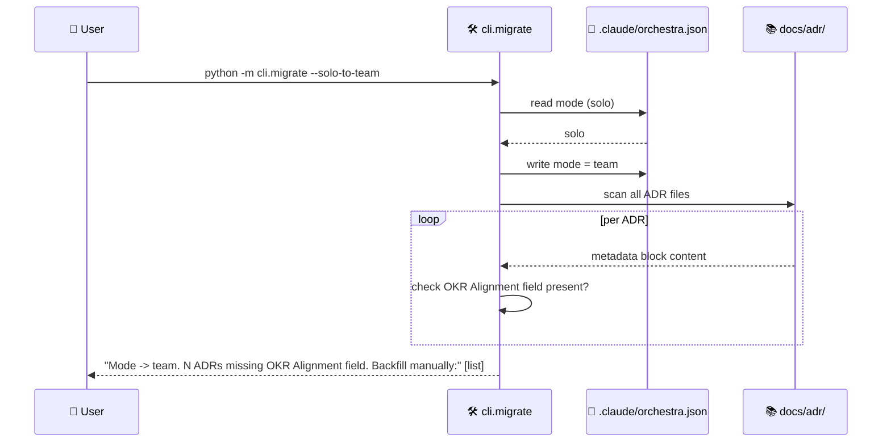
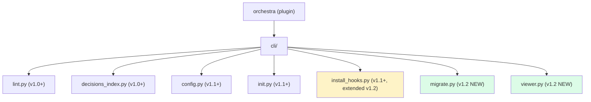

# Feature: orchestra v1.2 — solo↔team migration + Tier 2 mermaid export + commit-msg hook

> **Doc ID:** 002-v1.2-migration-viewer-commit-msg
> **Date:** 2026-05-06
> **DRI:** Hassan Mohiddin
> **Type:** Feature LLD
> **Status:** Draft

## Problem Statement

Three concrete v1.2 gaps surfaced in v1.1 ship:

1. **Solo→team migration is manual.** When a solo project hires its 2nd senior engineer (industry threshold), `mode` flips solo→team. `OKR Alignment` becomes mandatory on ADRs. Existing ADRs lack this field. Today users must hand-edit every ADR. No tool support.
2. **Mermaid offline viewing absent.** v1.1 Tier 1 docs cover GitHub/VS Code/JetBrains/mermaid.live native rendering. Tier 2 — exporting mermaid to PNG/SVG for offline review, presentations, air-gapped envs — has no orchestra-shipped helper. Users must remember `npx -y @mermaid-js/mermaid-cli` invocations and target paths.
3. **Refs:-line check fires too late.** v1.1 pre-commit hook runs `cli.lint --pre-commit` at file-content time. Conventional Commits spec puts `Refs:` in the commit message body — checked AFTER the user types it. If commit msg lacks Refs:, hook fails and user re-types. Industry pattern is `commit-msg` hook (fires on message author, before commit lands) — surfaces error pre-commit-finalization.

Without v1.2: solo founders hiring teams hit ADR migration friction; offline reviewers can't easily share rendered diagrams; Refs: enforcement is reactive instead of proactive.

## Success Criteria

- [ ] `python -m cli.migrate --solo-to-team` flips `.claude/orchestra.json` mode + reports ADRs missing `OKR Alignment` for backfill
- [ ] `python -m cli.migrate --team-to-solo` reverse migration (less common but supported)
- [ ] `python -m cli.viewer render <doc.md>` extracts mermaid blocks and exports PNG/SVG to `docs/.rendered/` (default) or user-specified output dir
- [ ] `python -m cli.viewer render-all` walks `docs/` recursively, renders every mermaid block found
- [ ] `cli/install_hooks.py` extended with `--commit-msg` flag installing `.git/hooks/commit-msg` checking Refs: line in message at author time
- [ ] 3 new eval scenarios pass (migrate-solo-to-team / mermaid-export / commit-msg-hook)
- [ ] All v1.1 tests still pass (53 → ≥53 plus new tests)

## Scope

### In Scope

- New CLI: `cli/migrate.py` (programmatic + module entry — `python -m cli.migrate`)
  - `--solo-to-team` — flip mode, report ADRs missing OKR Alignment
  - `--team-to-solo` — flip mode, report ADRs that no longer need OKR Alignment
  - Idempotent: rerun = no-op if already in target mode
- New CLI: `cli/viewer.py` (programmatic + module entry — `python -m cli.viewer`)
  - `render <doc.md>` — extract mermaid blocks, render to PNG/SVG via `npx mermaid-cli`
  - `render-all` — walk docs/ recursively
  - `--format png|svg` (default svg)
  - `--output <dir>` (default `docs/.rendered/`)
  - Graceful exit if `npx` absent (instructs user)
- Extend `cli/install_hooks.py`:
  - `--commit-msg` flag installs `.git/hooks/commit-msg` template
  - Hook checks: if first line matches `^(fix|feat)(\(.*\))?:` → body must contain `Refs: docs/<path>` pointing to real file
  - Idempotent + diff-prompt for existing hook (same pattern as v1.1)
- New tests: `tests/test_cli_migrate.py`, `tests/test_cli_viewer.py`, extended `tests/test_cli_install_hooks.py`
- 3 new eval scenarios: `migrate-solo-to-team.json`, `mermaid-export.json`, `commit-msg-hook.json`
- README update: add Tier 2 mermaid export to "Viewing diagrams" section
- Plugin version bump 1.1.0 → 1.2.0

### Out of Scope (deferred)

- **v1.3:** Orchestra-flavored doc browser (Tier 3 — local server + cross-doc nav + status filter)
- **v1.5:** Plugin scan + registry generation + plugin manifest spec
- **v2.0:** orchestra:workflow skill
- Auto-backfill ADR `OKR Alignment` field with inferred values — too risky; v1.2 only REPORTS missing fields, user backfills manually
- Mermaid render caching (re-render on every invocation in v1.2; cache by file hash in v1.3+ if perf becomes issue)
- Render to formats other than PNG/SVG (PDF, JPEG deferred to v1.3+)
- `commit-msg` hook for non-orchestra commits (only validates `fix:`/`feat:` per existing convention)

## Design

### Architecture / Data Flow



### Skill / module hierarchy (v1.2 additions)



### `cli/migrate.py` — pseudocode

```python
def migrate_solo_to_team(root: Path, dry_run: bool = False) -> MigrationResult:
    from cli.config import load_config
    from cli.init import write_v11_config
    config = load_config(root).config
    if config["orchestra"]["mode"] == "team":
        return MigrationResult(no_op=True, message="Already team mode.")

    # Flip mode
    if not dry_run:
        config["orchestra"]["mode"] = "team"
        write_v11_config(root, config)

    # Scan ADRs for missing OKR Alignment
    adr_dir = root / config["skills"]["design-docs"]["doc_paths"]["adr"]
    missing: list[Path] = []
    for adr in sorted(adr_dir.glob("ADR-*.md")):
        text = adr.read_text()
        # Search metadata block (first 25 lines) for OKR Alignment
        head = "\n".join(text.splitlines()[:25])
        if "OKR Alignment:" not in head:
            missing.append(adr)

    return MigrationResult(
        no_op=False,
        new_mode="team",
        adrs_needing_backfill=missing,
        message=f"Mode -> team. {len(missing)} ADRs missing OKR Alignment.",
    )


def migrate_team_to_solo(root: Path, dry_run: bool = False) -> MigrationResult:
    """Reverse: flip mode to solo. OKR Alignment now optional, no action needed."""
    # Symmetric to above. Just flip the mode + report.
    ...
```

### `cli/viewer.py` — pseudocode

```python
def render_doc(doc: Path, output_dir: Path, format: str = "svg") -> RenderResult:
    """Extract mermaid blocks, export each to <output_dir>/<doc-stem>-<index>.<format>."""
    if not shutil.which("npx"):
        raise ViewerError("npx not found — install Node.js to use mermaid render")

    em = _load_extract_mermaid()  # importlib path-loaded helper from cli/lint.py pattern
    diagrams = em.extract_diagrams_from_file(doc)
    if not diagrams:
        return RenderResult(rendered=[], skipped="no mermaid blocks")

    output_dir.mkdir(parents=True, exist_ok=True)
    rendered: list[Path] = []
    for d in diagrams:
        out_file = output_dir / f"{doc.stem}-{d.index:02d}.{format}"
        proc = subprocess.run(
            ["npx", "-y", "@mermaid-js/mermaid-cli",
             "-i", "/dev/stdin", "-o", str(out_file),
             "-w", "1600", "-H", "1200"],
            input=d.content, capture_output=True, text=True, timeout=60,
        )
        if proc.returncode == 0:
            rendered.append(out_file)
        else:
            # Log error but continue with remaining diagrams
            print(f"failed to render {doc.name}#{d.index}: {proc.stderr[:200]}", file=sys.stderr)

    return RenderResult(rendered=rendered)


def render_all(root: Path, output_dir: Path, format: str = "svg") -> list[RenderResult]:
    """Walk docs/, render every mermaid block found."""
    docs_dir = root / "docs"
    results = []
    for md in docs_dir.rglob("*.md"):
        results.append(render_doc(md, output_dir, format))
    return results
```

Default output: `docs/.rendered/`. v1.1 `GITIGNORE_ENTRIES` (cli/init.py) does NOT include this path. v1.2 implementation: `cli.viewer` self-checks on first run — if `docs/.rendered/` not in `.gitignore`, append it (mirrors v1.1 idempotent gitignore-append pattern). Documented in v1.2 implementation plan as a sub-task of Task `viewer.py`.

### `commit-msg` hook — script content

```bash
#!/usr/bin/env bash
# Orchestra commit-msg hook — verify Refs: line on fix:/feat: commits at message-author time.
# Installed by `python -m cli.install_hooks --commit-msg`.

set -euo pipefail

MSG_FILE="$1"
SUBJECT=$(head -n1 "$MSG_FILE")

if echo "$SUBJECT" | grep -qE '^(fix|feat)(\(.*\))?:'; then
    if ! grep -q '^Refs: docs/' "$MSG_FILE"; then
        echo "error: commit subject is fix:/feat: but message body has no 'Refs: docs/...' line." >&2
        echo "Required by orchestra commit-strategy.md (see .claude/rules/commit-strategy.md or docs/STANDARDS.md)." >&2
        exit 1
    fi
fi

exit 0
```

Installed at `.git/hooks/commit-msg`. Fires when user types commit message; if violation, hook exit 1 → commit aborts → user re-edits. Pre-commit hook from v1.1 still runs at file-content time and remains complementary (catches different defect classes).

### Idempotency contracts (all v1.2 new code)

| Module | Idempotent behavior |
|---|---|
| `cli.migrate --solo-to-team` | If already team → no-op, message "Already team mode." Same for reverse. |
| `cli.viewer render` | Re-rendering overwrites output PNG/SVG (deterministic). No corruption on repeat. |
| `cli.install_hooks --commit-msg` | Detect existing hook → diff + prompt: append/replace/skip (default skip). Same as `--pre-commit` v1.1 logic. |

## API Changes

No HTTP API. CLI surface only.

### CLI API (new + extended)

| Command | Status | Description |
|---|---|---|
| `python -m cli.migrate --solo-to-team` | NEW (v1.2) | Flip mode solo→team + report ADRs missing OKR Alignment |
| `python -m cli.migrate --team-to-solo` | NEW (v1.2) | Reverse migration |
| `python -m cli.migrate --dry-run` | NEW (v1.2) | Preview without writing config |
| `python -m cli.viewer render <doc.md>` | NEW (v1.2) | Render mermaid blocks of one doc |
| `python -m cli.viewer render-all` | NEW (v1.2) | Walk `docs/`, render all |
| `python -m cli.viewer --format <png\|svg>` | NEW (v1.2) | Output format |
| `python -m cli.viewer --output <dir>` | NEW (v1.2) | Output directory (default `docs/.rendered/`) |
| `python -m cli.install_hooks --commit-msg` | EXTENDED (v1.2) | Install commit-msg hook (in addition to v1.1 pre-commit) |
| `python -m cli.install_hooks --all` | NEW (v1.2 convenience) | Install both pre-commit + commit-msg in one call |

## Database Changes

Not applicable.

## Edge Cases & Error Handling

| Scenario | Expected Behavior |
|---|---|
| `migrate --solo-to-team` when already team mode | No-op, exit 0, message "Already in team mode" |
| `migrate --solo-to-team` when no ADRs exist | Exit 0, message "Mode → team. No ADRs to check." |
| `migrate --solo-to-team` with malformed orchestra.json | Exit 1, error message + suggested fix |
| `viewer render` when npx absent | Exit 1, install hint, no partial output |
| `viewer render` when mermaid block has parse error | Continue with remaining diagrams; report failures at end |
| `viewer render` on file with no mermaid blocks | Exit 0, message "no mermaid blocks found", no files written |
| `viewer render-all` on empty docs/ | Exit 0, no files written, message "0 docs scanned" |
| `install_hooks --commit-msg` in non-git repo | Exit 1 (existing v1.1 logic) |
| commit-msg hook on `fix:` commit without Refs: | Hook exit 1, commit aborts, error printed |
| commit-msg hook on `chore:` / `docs:` / `test:` / `refactor:` commit | Hook exit 0, Refs: not required (only fix:/feat: gated) |
| commit-msg hook on `feat:` commit with `Refs: nonexistent.md` | Hook exit 0 (file existence checked by `cli.lint --pre-commit`, not commit-msg hook — they're complementary) |

## Security Considerations

- **Path validation:** `cli.viewer` writes to user-specified `--output`. Validate path against repo root (must be inside repo) — reject `/etc/...` or `../../etc/...`. Same regex used in v1.1 custom-type path validation.
- **Subprocess input:** `npx mermaid-cli` consumes mermaid block via stdin (no shell interpolation). Timeout 60s per diagram (longer than lint's 30s — render is heavier).
- **Hook injection:** commit-msg hook script template is static (no user-supplied content). Existing-hook diff prompt prevents accidental overwrite.
- **Migration race:** if user runs `migrate --solo-to-team` while another process is writing `.claude/orchestra.json`, file might be partially written. Mitigation: write to `.tmp` + atomic rename (POSIX). Test included.

## Testing Strategy

- **Unit:**
  - `cli.migrate.migrate_solo_to_team()` — flip + scan-no-OKR + return result
  - `cli.migrate.migrate_team_to_solo()` — reverse
  - `cli.migrate` dry-run — no file writes
  - `cli.viewer.render_doc()` — extract → render via mocked subprocess (don't actually invoke npx in unit tests)
  - `cli.viewer.render_all()` — walk + accumulate
  - `cli.install_hooks` `--commit-msg` flag — install commit-msg hook script
- **Integration:**
  - `test_migrate_solo_to_team_with_adrs` — fixture repo with ADRs missing OKR Alignment → migration reports correct count
  - `test_migrate_idempotent` — rerun = no-op
  - `test_install_commit_msg_hook` — fresh repo + install → hook executable + content correct
  - `test_commit_msg_hook_blocks_orphan_feat` — set up repo with hook, attempt `git commit -m "feat: x"` → exit 1 (skip on CI without git binary; use subprocess fallback)
- **Eval scenarios (3 new):**
  - `migrate-solo-to-team` — fixture repo solo + 2 ADRs (1 with OKR, 1 without) → migration → mode = team, report flags 1 ADR
  - `mermaid-export` — render fixture doc with 2 mermaid blocks → 2 SVG files in output dir
  - `commit-msg-hook` — install hook + try to commit `feat:` without Refs: → hook blocks (subprocess fallback if no real git)
- **Backward compat:** all 53 v1.1 tests still pass.

## Dependencies

- Python 3.14 (per LLD-001 + repo standard; pyproject.toml lower bound is 3.10 for portability)
- `npx` + `@mermaid-js/mermaid-cli` (optional runtime — cli.viewer requires it; cli.migrate + commit-msg hook do not)
- No new Python packages

## Related Documents

- LLD-001: `orchestra-dev/features/001-design-docs-init.md` — v1.1 baseline this LLD builds on
- ADR-001: `orchestra-dev/adr/ADR-001-orchestra-config-storage.md` — config storage shape inherited
- Roadmap: `orchestra-dev/plans/2026-05-06-orchestra-roadmap.md` — v1.2 row aligns with this LLD
- Plan: `orchestra-dev/plans/2026-05-06-orchestra-v1.2-implementation.md` — written after this LLD passes spec review
- Philosophy: `orchestra-dev/design/orchestra-philosophy.md` — Solo↔team mode philosophy + Mode System section

## Workspace Layout Note

This LLD lives at `SCALE_APP/orchestra-dev/features/002-...md` (SCALE-side dev workspace) and is mirrored to `orchestra/docs/features/002-...md` via `bash orchestra-dev/sync-orchestra-dev.sh`. v1.1 dev pattern continues — once v1.2 ships and the user moves fully to orchestra repo, sync stops.

## Changelog

| Date | Change |
|---|---|
| 2026-05-06 | Initial draft — Status: Draft. Synthesized from roadmap doc v1.2 row + LLD-001 deferrals. |
| 2026-05-06 | Iteration 1 spec review — 4/4 gates pass. 3 minor nits applied: (1) `load_config` import source clarified in pseudocode; (2) Python version aligned to 3.14 (LLD-001 + repo standard); (3) `docs/.rendered/` gitignore claim corrected — v1.1 template does NOT include this path; v1.2 viewer self-checks on first run. Status remains Draft pending plan + commit. |
