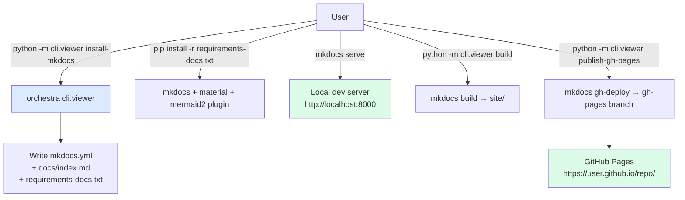

# Feature: orchestra v1.3 — Tier 3 doc browser via MkDocs

> **Doc ID:** 003-v1.3-doc-browser-mkdocs
> **Date:** 2026-05-06
> **DRI:** Hassan Mohiddin
> **Type:** Feature LLD
> **Status:** Verified

## Problem Statement

v1.1 + v1.2 ship Tier 1 (native renderers) and Tier 2 (CLI export to PNG/SVG) for mermaid diagrams. Both serve READ-ONLY consumption of docs.

What's missing in v1.2:
1. **No browsable doc surface.** Users can read individual `.md` files but can't search across docs, filter by type/status, or follow cross-doc links visually. GitHub renders one file at a time; mermaid.live is per-block; CLI export is static images.
2. **No public publish path.** Solo founders writing docs in `docs/` can't easily share a polished read-only view with non-technical stakeholders or potential team members.
3. **Doc discoverability.** Once `docs/` has 30+ entries (Feature LLDs, ADRs, Postmortems), navigating by filename alone is friction-heavy. Users want: type-filtered list, status-filtered list, full-text search.

Without v1.3: orchestra docs are git-native but not human-friendly at scale. Adoption stalls past medium-size doc trees.

## Success Criteria

- [ ] `python -m cli.viewer install-mkdocs` writes 4 files (`mkdocs.yml`, `docs/index.md`, `requirements-docs.txt`, `mkdocs_hooks.py`) AND appends `site/` to `.gitignore`
- [ ] User runs `mkdocs serve` → doc site live at `http://localhost:8000` with all `docs/` entries browseable
- [ ] Mermaid blocks render natively in served pages (via `mkdocs-mermaid2-plugin`)
- [ ] Search across docs works (built-in mkdocs material theme search)
- [ ] Type filter (Feature LLD / Bug Report / ADR / etc.) navigable via sidebar grouping
- [ ] `python -m cli.viewer publish-gh-pages` builds + pushes to gh-pages branch (one-liner GitHub Pages publish)
- [ ] Status filter enabled via mkdocs material theme tags (each doc has front-matter `tags: [Status]`)
- [ ] 2 new eval scenarios pass (mkdocs-install, mkdocs-build)
- [ ] All v1.2 tests still pass (≥84 total = 77 v1.2 + ~7 new v1.3 tests)
- [ ] Plugin version bumped 1.2.0 → 1.3.0

## Scope

### In Scope

- Decision: **MkDocs (Material theme) over custom Flask/FastAPI server.**
  - Industry-standard doc-site generator (Backstage, Kubernetes, FastAPI all use it)
  - Built-in search, navigation, theme, GitHub Pages publish
  - `mkdocs-mermaid2-plugin` renders mermaid natively
  - Less code to maintain than a custom server
  - Single dep tree (`mkdocs`, `mkdocs-material`, `mkdocs-mermaid2-plugin`) — installed by user via `pip install -r requirements-docs.txt` (orchestra ships the requirements file template)
- New CLI: `cli/viewer.py` extended:
  - `install-mkdocs` — writes 4 files (mkdocs.yml + docs/index.md + requirements-docs.txt + mkdocs_hooks.py) AND appends `site/` to `.gitignore` via reuse of existing `_ensure_gitignore_rendered()` pattern in `cli/viewer.py:57-65`
  - `publish-gh-pages` — wraps `mkdocs gh-deploy` (one-liner publish)
  - `build` — wraps `mkdocs build` (static site to `site/`)
- New CLI templates:
  - `cli/templates/mkdocs.yml` — orchestra-flavored config (Material theme, mermaid plugin, navigation grouped by doc type)
  - `cli/templates/docs-index.md` — front page template referencing all doc types + STANDARDS.md link
  - `cli/templates/requirements-docs.txt` — pinned mkdocs deps
  - `cli/templates/mkdocs_hooks.py` — status-tag synthesis hook (extracts `Status:` from existing metadata block → mkdocs tag; copied into repo root by `install-mkdocs`)
- README update: add Tier 3 row to "Viewing diagrams" section
- 2 new eval scenarios
- Plugin version bump

### Roadmap reconciliation (deviations from `2026-05-06-orchestra-roadmap.md` v1.3 row)

The roadmap drafted v1.3 scope before this LLD resolved its open question. Diffs from roadmap:

| Roadmap claim | LLD-003 resolution |
|---|---|
| `python -m cli.viewer serve` (custom server) | DROPPED — `mkdocs serve` provides it natively. No custom server. |
| Static-site-generator vs custom Flask/FastAPI (open question) | RESOLVED — MkDocs (Material theme). |
| Auto-rebuilds DECISIONS.md on file watch | DEFERRED to v1.4 or later — mkdocs has its own file-watch via `mkdocs serve`, but it doesn't trigger `cli.decisions_index`. Cross-tool watcher requires extra orchestration; not v1.3. Documented as known gap; users run `python -m cli.decisions_index` manually before `mkdocs build` if ADR index needs refresh. |
| Eval: 1 scenario (viewer-renders-correctly) | EXPANDED to 2 scenarios (mkdocs-install + mkdocs-build) for tighter coverage. |
| Optional GitHub Pages publish path | INCLUDED — `cli.viewer publish-gh-pages` wraps `mkdocs gh-deploy`. |

The roadmap doc will get a deviation entry recording these diffs in the same commit as v1.3 ship.

### Out of Scope (deferred — for THIS feature only)

- Custom Flask/FastAPI server (rejected — MkDocs is better fit)
- Real-time file watch + auto-rebuild beyond `mkdocs serve` default behavior (mkdocs already provides this)
- Cross-tool watcher (DECISIONS.md auto-rebuild on ADR change) — see Roadmap reconciliation above
- Authenticated/private publish (orchestra is OSS-first; private hosting is out of scope)
- Custom themes beyond Material (users can swap themes via mkdocs.yml; orchestra ships Material as default)
- Markdown-to-PDF export (separate feature; not v1.3)
- Doc analytics / view counts (privacy + scope)

## Design

### Architecture



### MkDocs Config Shape

`mkdocs.yml` template structure:

```yaml
site_name: Orchestra Docs
site_description: Documentation for this orchestra-managed project
site_url: ""  # filled by user / GitHub Pages

theme:
  name: material
  palette:
    primary: indigo
  features:
    - navigation.sections
    - navigation.expand
    - navigation.path
    - search.suggest
    - search.highlight
    - content.tabs.link

plugins:
  - search
  - mermaid2:
      # version key pins mermaid.js library loaded from CDN.
      # 10.9.1 is the latest stable mermaid release as of 2026-05-06,
      # tested with mkdocs-mermaid2-plugin >=1.2.0 + mkdocs-material >=9.5.0.
      # Users can bump independently without breaking the plugin.
      version: 10.9.1
  - tags

markdown_extensions:
  - admonition
  - pymdownx.details
  - pymdownx.superfences:
      custom_fences:
        - name: mermaid
          class: mermaid
          format: !!python/name:mermaid2.fence_mermaid_custom
  - pymdownx.tabbed:
      alternate_style: true
  - tables
  - toc:
      permalink: true

nav:
  - Home: index.md
  - Standards: STANDARDS.md
  - Decisions:
    - Index: adr/DECISIONS.md
    - Records: adr/
  - Features: features/
  - Bugs: bugs/
  - Design Docs: design/
  - Postmortems: postmortems/
  - Runbooks: runbooks/
  - Plans: plans/

hooks:
  - mkdocs_hooks.py
```

**MkDocs `docs_dir` default is `docs/`** (mkdocs documented default). All nav paths above resolve relative to `docs/`. Project's STANDARDS.md (`docs/STANDARDS.md` per orchestra convention) maps to nav entry `Standards: STANDARDS.md` correctly.

### docs/index.md Template

Landing page with sections: project overview, doc types with counts, recent decisions, search hint, contributing.

### Filtering by Status

MkDocs Material theme supports `tags` plugin. Each doc's front matter (already present in orchestra docs as metadata block) gets a tag synthesized from `Status` field. Users browse `/tags/Verified/` etc.

v1.3 ships a small mkdocs hook at repo-root path `mkdocs_hooks.py` (template at `cli/templates/mkdocs_hooks.py`, copied by `install-mkdocs`). The hook auto-extracts `Status:` from existing metadata blocks (no front-matter retrofit required) and converts to a Material theme tag. mkdocs.yml registers this hook via `hooks: [mkdocs_hooks.py]`.

### `cli.viewer` extension

```python
# cli/viewer.py — new dataclass + functions
# (extends existing argparse subparsers in main(); reuses _ensure_gitignore_rendered())

@dataclass
class InstallResult:
    files_written: list[Path] = field(default_factory=list)
    files_skipped: list[Path] = field(default_factory=list)
    errors: list[str] = field(default_factory=list)

    @property
    def ok(self) -> bool:
        return not self.errors


def install_mkdocs(repo_root: Path, force: bool = False) -> InstallResult:
    """Write 4 files (mkdocs.yml, docs/index.md, requirements-docs.txt,
    mkdocs_hooks.py) and append site/ to .gitignore via reuse of
    _ensure_gitignore_rendered() helper pattern (cli/viewer.py:57-65)."""
    # Idempotent skip-existing pattern (same as v1.1 init.scaffold_bucket_1)
    # Templates from cli/templates/{mkdocs.yml,docs-index.md,requirements-docs.txt,mkdocs_hooks.py}
    ...


def build_site(repo_root: Path, output_dir: Path = Path("site")) -> int:
    """Wrap `mkdocs build`. Validates mkdocs installed; instructs if not."""
    if not _mkdocs_available():
        raise ViewerError("mkdocs not installed. Run: pip install -r requirements-docs.txt")
    return subprocess.call(["mkdocs", "build", "-d", str(output_dir)], cwd=str(repo_root))


def publish_gh_pages(repo_root: Path) -> int:
    """Wrap `mkdocs gh-deploy`. Validates clean working tree first."""
    if not _mkdocs_available():
        raise ViewerError("mkdocs not installed. Run: pip install -r requirements-docs.txt")
    # Check git status — refuse if dirty
    result = subprocess.run(["git", "status", "--porcelain"], cwd=str(repo_root),
                           capture_output=True, text=True)
    if result.stdout.strip():
        raise ViewerError("git working tree is dirty. Commit or stash first.")
    return subprocess.call(["mkdocs", "gh-deploy", "--force"], cwd=str(repo_root))


def _mkdocs_available() -> bool:
    return shutil.which("mkdocs") is not None
```

The new commands wire into the existing `argparse` subparsers in `cli/viewer.py:main()` — three new `sub.add_parser(...)` calls for `install-mkdocs`, `build`, `publish-gh-pages`.

### Idempotency contracts

| Module | Idempotent behavior |
|---|---|
| `cli.viewer install-mkdocs` | Skip-existing default; `--force` overwrites mkdocs.yml + index.md |
| `cli.viewer build` | mkdocs internally idempotent (rebuilds site/ from scratch) |
| `cli.viewer publish-gh-pages` | mkdocs internally pushes to gh-pages branch; refuses if working tree dirty |

## API Changes

No HTTP API. CLI surface only.

### CLI API (extension to v1.2)

| Command | Status | Description |
|---|---|---|
| `python -m cli.viewer install-mkdocs` | NEW (v1.3) | Write 4 files (mkdocs.yml, docs/index.md, requirements-docs.txt, mkdocs_hooks.py) + append `site/` to .gitignore |
| `python -m cli.viewer install-mkdocs --force` | NEW (v1.3) | Overwrite existing config |
| `python -m cli.viewer build` | NEW (v1.3) | Wrap `mkdocs build` |
| `python -m cli.viewer publish-gh-pages` | NEW (v1.3) | Wrap `mkdocs gh-deploy` |
| `python -m cli.viewer render` | EXISTING (v1.2) | unchanged |
| `python -m cli.viewer render-all` | EXISTING (v1.2) | unchanged |

## Database Changes

Not applicable.

## Edge Cases & Error Handling

| Scenario | Expected Behavior |
|---|---|
| `install-mkdocs` when mkdocs.yml exists | Skip-existing, exit 0 with "mkdocs.yml already present, skipping" |
| `build --output build/static` (non-default) | mkdocs writes there, but orchestra's `.gitignore` only added `site/`. User responsibility to gitignore custom paths; documented in README. |
| `install-mkdocs --force` overwrites | Replace mkdocs.yml + index.md unconditionally |
| `build` when mkdocs not installed | Raise ViewerError with install hint, exit 1 |
| `publish-gh-pages` with dirty working tree | Refuse, exit 1, print suggestion ("commit or stash first") |
| `publish-gh-pages` when no remote configured | Defer to mkdocs error message (gh-deploy will surface) |
| Mermaid block in served page renders incorrectly | mkdocs-mermaid2-plugin handles; if it fails, error in rendered page (not orchestra's responsibility) |
| Status tag missing on doc | Hook fallback: tag = "Untagged" + warn in build log |
| User has custom mkdocs.yml | install-mkdocs respects skip-existing; user must use --force or merge manually |
| GitHub Pages disabled in repo | `gh-deploy` errors; orchestra surfaces hint to enable Pages in repo settings |

## Security Considerations

- **No new code execution paths.** mkdocs runs as user-level subprocess (not privileged).
- **gh-deploy pushes to gh-pages branch.** Default behavior of mkdocs; orchestra adds dirty-tree check before invoking.
- **mkdocs.yml is data, not code.** No `!!python/...` tags except the documented `mermaid2.fence_mermaid_custom` (vetted upstream package).
- **Template paths.** All install paths relative to repo root, validated against `^[a-z][a-z0-9-]*$` regex pattern (consistent with LLD-001 line 416 and v1.1 path validation).
- **Requirements pinning.** `requirements-docs.txt` pins exact versions of mkdocs/material/mermaid2 to prevent supply-chain drift; user can update later.

## Testing Strategy

- **Unit tests:**
  - `cli.viewer.install_mkdocs()` — idempotent skip-existing, --force overwrite, gitignore append
  - `cli.viewer._mkdocs_available()` — true when on PATH, false when absent (mocked)
  - `cli.viewer.build_site()` — error if mkdocs absent (mocked subprocess)
  - `cli.viewer.publish_gh_pages()` — error if dirty tree (mocked git status output)
- **Integration tests:**
  - `test_install_mkdocs_fresh_repo` — empty repo → mkdocs.yml + docs/index.md + requirements-docs.txt + gitignore append
  - `test_install_mkdocs_idempotent` — rerun = no-op
  - `test_install_mkdocs_force_overwrites` — `--force` regenerates
- **Eval scenarios (2 new):**
  - `mkdocs-install` — install in fixture repo, verify all 4 files written + `.gitignore` contains `site/`
  - `mkdocs-build` — install + run `mkdocs build` (skip if mkdocs not on PATH; smoke-test only)
- **Backward compat:** all 77 v1.2 tests still pass.

## Dependencies

- Python 3.14 (existing)
- Optional runtime deps (user installs after `install-mkdocs` writes requirements-docs.txt):
  - `mkdocs >=1.6.0`
  - `mkdocs-material >=9.5.0`
  - `mkdocs-mermaid2-plugin >=1.2.0`
- Orchestra plugin itself adds NO new Python deps (orchestra cli stays stdlib-only)

## Related Documents

- LLD-001: `orchestra-dev/features/001-design-docs-init.md` — v1.1 baseline
- LLD-002: `orchestra-dev/features/002-v1.2-migration-viewer-commit-msg.md` — v1.2 baseline (cli.viewer Tier 2 extended in v1.3)
- ADR-001: `orchestra-dev/adr/ADR-001-orchestra-config-storage.md` — config storage
- Roadmap: `orchestra-dev/plans/2026-05-06-orchestra-roadmap.md` — v1.3 row
- Plan: `orchestra-dev/plans/2026-05-06-orchestra-v1.3-implementation.md` — to be written after this LLD passes review
- Philosophy: `orchestra-dev/design/orchestra-philosophy.md` — Tier 3 doc browser was reframed in 2026-05-06 brainstorm as "real differentiator vs raw markdown"

## Workspace Layout Note

This LLD lives at `SCALE_APP/orchestra-dev/features/003-...md` (SCALE-side dev workspace) and is mirrored to `orchestra/docs/features/003-...md` via `bash orchestra-dev/sync-orchestra-dev.sh`.

## Changelog

| Date | Change |
|---|---|
| 2026-05-06 | Initial draft — Status: Draft. Synthesized from roadmap doc v1.3 row + LLD-001 brainstorm reframing of Tier 3. Decision: MkDocs (Material) over custom Flask/FastAPI server. |
| 2026-05-06 | Iteration 1 spec review — 1/4 gates pass. 11 fixes applied: (1) test count corrected (77 not 75); (2) install-mkdocs file list reconciled across L22/L43/L48 — 5 files written; (3) Roadmap reconciliation subsection added explaining DECISIONS.md auto-rebuild deferred to v1.4+, eval count 1→2, no `serve` command (mkdocs native); (4) `InstallResult` dataclass defined with field sketch; (5) regex cite tightened to `^[a-z][a-z0-9-]*$`; (6) hook path explicit (`mkdocs_hooks.py` at repo root, copied by install-mkdocs, registered in mkdocs.yml `hooks:`); (7) DRY note added — install-mkdocs reuses existing `_ensure_gitignore_rendered()`; (8) `output_dir: Path = Path("site")` typed correctly; (9) custom output dir `--output build/static` edge case documented (user gitignores manually); (10) mermaid2 plugin version pin commented with rationale; (11) `docs_dir` default footnote added. Status remains Draft pending iteration 2. |
| 2026-05-06 | Iteration 2 spec review — 3/4 gates pass. Fix applied: file-count framing standardized to "4 files written + 1 .gitignore append" across Success Criteria L22, scope summary L44, function docstring L191, CLI API table L240, eval scenario L286. Test count target made explicit (≥84). Status remains Draft pending user approval. |
| 2026-05-06 | All 7 plan tasks implemented. Verification: 85 pytest tests pass + 10/10 eval scenarios pass. Plugin version bumped 1.2.0 → 1.3.0. Status: Verified. DEVIATIONS: (a) `_ensure_gitignore_rendered` extracted into shared helper `_ensure_gitignore_entry` to support both `docs/.rendered/` and `site/` entries; v1.2 entry preserved as alias for backward compat. (b) Templates created in single commit alongside cli.viewer extension (Tasks 1+2 combined per dependency graph). (c) test_publish_gh_pages_errors_when_mkdocs_absent added beyond the planned 7 tests (covers missing-mkdocs path on publish — symmetry with build_site coverage). |
