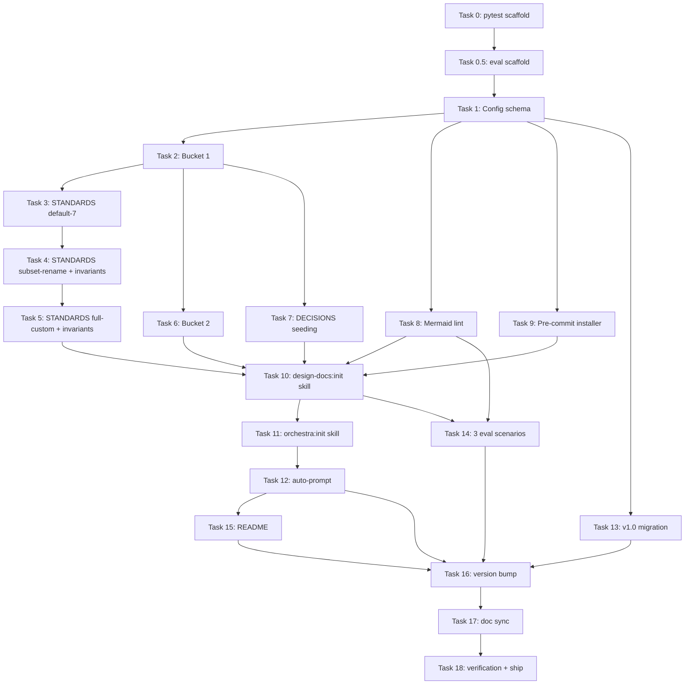

# Orchestra v1.1 — Implementation Plan

> **Doc ID:** 2026-05-06-orchestra-v1.1-implementation
> **Date:** 2026-05-06
> **DRI:** Hassan Mohiddin
> **Type:** Implementation Plan
> **Status:** Active
> **LLD:** `orchestra-dev/features/001-design-docs-init.md`

## Header

**Goal:** Implement orchestra v1.1 per LLD-001 — design-docs:init skill + setup infrastructure + mermaid lint + pre-commit hook installer + v1.0→v1.1 migration. Ship in TDD vertical slices.

**Architecture:** Per LLD-001 sequence diagram (lines 75-106). Per ADR-001 config storage at `.claude/orchestra.json`. Per philosophy doc Skill Hierarchy (orchestra → workflow → design-docs).

**Tech stack:**
- Skills: markdown SKILL.md files + frontmatter
- CLI: Python 3.14 stdlib (subprocess, pathlib, json, re, shutil, importlib.util)
- Tests: pytest (NEW — `orchestra/tests/` does not yet exist; Task 0 creates it)
- Eval: skill-creator framework (NEW — `orchestra/eval/` does not yet exist; v1.0 had no in-repo eval framework. v1.1 scaffolds it.)
- Linting: existing `cli/lint.py` extended with `--mermaid` flag
- Mermaid: optional `npx @mermaid-js/mermaid-cli` runtime dep

**LLD reference:** All design decisions live in LLD-001. This plan does NOT re-state design — it sequences implementation. Per LLD-001 changelog deviation entry 2026-05-06: invariants enforcement is part of `cli/init.py` (no separate `cli/invariants.py` module).

**Sync mechanism reminder:** During v1.1 dev, files written under `orchestra-dev/` (SCALE) mirror to `orchestra/docs/` via `bash orchestra-dev/sync-orchestra-dev.sh`. Implementation files written directly under `orchestra/` (skills, cli, tests, eval, schema) — these are NOT mirrored, they live only in the orchestra repo.

## File Structure

Files created or modified, all paths relative to `orchestra/` repo:

```
orchestra/
├── pyproject.toml                         # NEW (Task 0) — pytest config, project metadata
├── skills/
│   ├── init/                              # NEW (Task 11) — orchestra:init master skill
│   │   └── SKILL.md
│   └── design-docs/
│       ├── init/                          # NEW (Task 10) — orchestra:design-docs:init sub-skill
│       │   ├── SKILL.md
│       │   └── prompts.md                 # 3-prompt flow scripts (markdown describing prompts)
│       ├── scripts/
│       │   └── extract_mermaid.py         # MODIFIED (Task 8) — expose extract_diagrams_from_file() + basic_syntax_check()
│       └── SKILL.md                       # MODIFIED (Task 12) — auto-prompt detection logic
├── cli/
│   ├── __init__.py                        # existing (no change)
│   ├── lint.py                            # MODIFIED (Task 8) — --mermaid flag
│   ├── decisions_index.py                 # existing (no change; consumed by Task 7)
│   ├── config.py                          # NEW (Task 1) — schema parser/validator
│   ├── init.py                            # NEW (Tasks 2-7) — scaffold + STANDARDS gen + invariants enforcement
│   ├── install_hooks.py                   # NEW (Task 9) — pre-commit hook installer
│   └── templates/                         # NEW (Task 3) — embedded template files
│       ├── standards-default-7.md
│       ├── orchestra-lint.yml
│       ├── AGENTS.md.template
│       ├── llms.txt.template
│       └── pre-commit.sh
├── schema/
│   └── orchestra.config.v1.1.json         # NEW (Task 1) — JSON schema
├── eval/
│   ├── __init__.py                        # NEW (Task 0.5)
│   ├── run.py                             # NEW (Task 0.5) — eval runner
│   └── scenarios/                         # NEW (Task 0.5)
│       ├── orchestra-fresh-init.json      # added in Task 10
│       ├── orchestra-custom-rename-rejected.json  # Task 14
│       ├── orchestra-rerun-idempotent.json # Task 14
│       ├── orchestra-mermaid-lint.json    # Task 14
│       └── orchestra-v10-migration.json   # added in Task 13
├── tests/
│   ├── __init__.py                        # NEW (Task 0)
│   ├── conftest.py                        # NEW (Task 0) — fixtures
│   ├── test_config.py                     # NEW (Task 1)
│   ├── test_cli_init_bucket1.py           # NEW (Task 2)
│   ├── test_standards_generator.py        # NEW (Tasks 3-5)
│   ├── test_cli_init_bucket2.py           # NEW (Task 6)
│   ├── test_decisions_seeding.py          # NEW (Task 7)
│   ├── test_cli_lint_mermaid.py           # NEW (Task 8)
│   ├── test_cli_install_hooks.py          # NEW (Task 9)
│   └── test_migration_v10_to_v11.py       # NEW (Task 13)
├── examples/
│   └── orchestra-config-example.json      # NEW (Task 1) — reference orchestra.json
├── .claude-plugin/plugin.json             # MODIFIED (Task 16) — bump version to 1.1.0
├── README.md                              # MODIFIED (Task 15) — Tier 1 mermaid viewing docs
└── CHANGELOG.md                           # MODIFIED (Task 16) — v1.1.0 entry
```

## Tasks (TDD vertical slicing)

Each task = one failing test → one implementation → one passing test → commit. Tasks ordered by dependency.

### Task 0: Scaffold pytest framework

- **Files:**
  - NEW: `orchestra/pyproject.toml` (with `[tool.pytest.ini_options]` and project metadata for orchestra v1.1)
  - NEW: `orchestra/tests/__init__.py` (empty)
  - NEW: `orchestra/tests/conftest.py` (fixture: `tmp_repo` provides `tmp_path`-based fresh-repo setup)
- **What:** Create pytest infrastructure. orchestra v1.0 ships no in-repo tests; this lays the foundation.
- **Test:** `pytest orchestra/tests/` returns 0 (no tests yet but framework loads).
- **Commit:** `test: scaffold pytest framework for v1.1 work`

### Task 0.5: Scaffold eval framework

- **Files:**
  - NEW: `orchestra/eval/__init__.py` (empty)
  - NEW: `orchestra/eval/run.py` (eval runner — loads scenario JSON, runs Claude Code session simulation, asserts skill behavior)
  - NEW: `orchestra/eval/scenarios/` (empty dir with .gitkeep — populated by later tasks)
- **What:** Create skill-creator-style eval framework. orchestra v1.0 ran scenarios ad-hoc against external skill-creator tool; v1.1 brings eval in-repo so CI can run it.
- **Test:** `python -m eval.run --list` returns 0 (no scenarios yet but module loads).
- **Commit:** `feat: scaffold in-repo eval framework. Refs: docs/features/001-design-docs-init.md`

### Task 1: Config schema + parser

- **Files:**
  - NEW: `orchestra/schema/orchestra.config.v1.1.json` (JSON schema)
  - NEW: `orchestra/cli/config.py` (parser/validator using stdlib `json` + custom validation; no `jsonschema` dep)
  - NEW: `orchestra/examples/orchestra-config-example.json` (reference)
  - NEW: `orchestra/tests/test_config.py`
- **What:** Define schema. Implement `load_config(path) -> dict` and `validate_config(config) -> list[ValidationError]`. Deep-merge logic for primary + local override.
- **Tests:**
  - `test_load_valid_config` — sample `orchestra.json` parses
  - `test_load_invalid_json` — malformed file → `ConfigError`
  - `test_unknown_mode_rejected` — `mode: "unicorn"` → `ValidationError`
  - `test_local_overrides_primary` — deep-merge logic
- **Commit:** `feat: orchestra config schema + parser. Refs: docs/features/001-design-docs-init.md`

### Task 2: Bucket 1 scaffold writer

- **Files:**
  - NEW: `orchestra/cli/init.py` (new module — `def scaffold_bucket_1(config, root) -> ScaffoldResult`)
  - NEW: `orchestra/tests/test_cli_init_bucket1.py`
- **What:** Given config + repo root, create 7 docs/ subdirs + .gitignore append. Idempotent skip-existing. STANDARDS.md generation in Task 3.
- **Tests:**
  - `test_fresh_scaffold_creates_7_dirs` — empty dir → all 7 docs subdirs created with .gitkeep
  - `test_scaffold_idempotent` — run twice → second is no-op
  - `test_gitignore_append_preserves_existing` — existing `.gitignore` rules preserved
- **Commit:** `feat: Bucket 1 scaffold (docs subdirs + gitignore). Refs: docs/features/001-design-docs-init.md`

### Task 3: STANDARDS.md generator (default-7 preset)

- **Files:**
  - MODIFIED: `orchestra/cli/init.py` (`def generate_standards_md(preset, renames, custom_types) -> str`)
  - NEW: `orchestra/cli/templates/standards-default-7.md` (template — direct copy of plugin-internal STANDARDS.md)
  - NEW: `orchestra/cli/templates/` directory itself
  - NEW: `orchestra/tests/test_standards_generator.py`
- **What:** Generate STANDARDS.md per preset. v1.1 ships default-7 path first; subset-rename + full-custom land in Tasks 4-5.
- **Tests:**
  - `test_default_7_emits_canonical_standards` — output matches plugin-internal STANDARDS.md byte-for-byte
- **Commit:** `feat: STANDARDS.md generator default-7 preset. Refs: docs/features/001-design-docs-init.md`

### Task 4: STANDARDS.md generator (subset-rename) + invariants

- **Files:**
  - MODIFIED: `orchestra/cli/init.py` (extend `generate_standards_md` for subset-rename; add `validate_rename(name) -> bool` against formal-vocab whitelist; whitelist constant `FORMAL_VOCAB_WHITELIST` defined inline)
  - MODIFIED: `orchestra/tests/test_standards_generator.py`
- **What:** Apply renames to canonical STANDARDS.md. Reject informal renames per whitelist. RFC explicitly NOT in whitelist (per LLD-001 reconciliation with philosophy doc).
- **Tests:**
  - `test_subset_rename_keeps_only_selected_types` — drop Postmortem → STANDARDS.md has no Postmortem section
  - `test_rename_feature_lld_to_tech_spec` — string-substitute works across all sections
  - `test_informal_rename_rejected` — rename "Feature LLD" → "doc" raises `InvariantViolation`
  - `test_rfc_rename_rejected_per_philosophy` — rename "Feature LLD" → "RFC" raises `InvariantViolation` (philosophy suppresses RFC vocab)
- **Commit:** `feat: STANDARDS.md subset-rename + formal-vocab whitelist. Refs: docs/features/001-design-docs-init.md`

### Task 5: STANDARDS.md generator (full-custom) + invariants

- **Files:**
  - MODIFIED: `orchestra/cli/init.py` (extend `generate_standards_md` for full-custom; add `validate_custom_type(t) -> list[InvariantViolation]`)
  - MODIFIED: `orchestra/tests/test_standards_generator.py`
- **What:** Generate STANDARDS.md from `custom_types` array. Enforce invariants in same module: Changelog mandatory, ≥3 status states with terminal, naming pattern in 3 allowed forms, formal-vocab heuristic for type names.
- **Tests:**
  - `test_full_custom_emits_correct_sections` — given 1 custom type, output has its required-sections list
  - `test_custom_type_missing_changelog_rejected` — required sections without Changelog → `InvariantViolation`
  - `test_custom_type_2_status_states_rejected` — minimum 3 enforced
  - `test_custom_type_freeform_naming_rejected` — must be one of 3 patterns
- **Commit:** `feat: STANDARDS.md full-custom + custom-type invariants. Refs: docs/features/001-design-docs-init.md`

### Task 6: Bucket 2 scaffold writer

- **Files:**
  - MODIFIED: `orchestra/cli/init.py` (`def scaffold_bucket_2(config, root) -> ScaffoldResult`)
  - NEW: `orchestra/cli/templates/orchestra-lint.yml` (GitHub Actions workflow)
  - NEW: `orchestra/cli/templates/AGENTS.md.template`
  - NEW: `orchestra/cli/templates/llms.txt.template`
  - NEW: `orchestra/tests/test_cli_init_bucket2.py`
- **What:** Generate Bucket 2 add-on files when prompted yes. DECISIONS.md handled separately (Task 7, always-run).
- **Tests:**
  - `test_bucket2_writes_all_addons` — `add_ons=True` → 3 files written
  - `test_bucket2_skips_when_off` — `add_ons=False` → no Bucket 2 files
  - `test_bucket2_idempotent` — rerun = no-op
- **Commit:** `feat: Bucket 2 scaffold (CI workflow + AGENTS.md + llms.txt). Refs: docs/features/001-design-docs-init.md`

### Task 7: DECISIONS.md seeding (always-run)

- **Files:**
  - MODIFIED: `orchestra/cli/init.py` (call existing `cli.decisions_index` after Bucket 1)
  - NEW: `orchestra/tests/test_decisions_seeding.py`
- **What:** Invoke existing `cli/decisions_index.py` to seed empty `docs/adr/DECISIONS.md`. Runs regardless of Bucket 2 prompt.
- **Tests:**
  - `test_decisions_seeded_on_init` — fresh init → `docs/adr/DECISIONS.md` exists with empty index
  - `test_decisions_idempotent` — rerun = file regenerated, no errors
- **Commit:** `feat: seed DECISIONS.md during init (always-run). Refs: docs/features/001-design-docs-init.md`

### Task 8: Mermaid lint integration

- **Files:**
  - MODIFIED: `orchestra/skills/design-docs/scripts/extract_mermaid.py` (expose `extract_diagrams_from_file(path)` as module-level function; add `MermaidDiagram.basic_syntax_check() -> list[LintError]`)
  - MODIFIED: `orchestra/cli/lint.py` (add `--mermaid` / `--no-mermaid` flags; load `extract_mermaid` via `importlib.util.spec_from_file_location` per LLD-001 line 295-298 option (a))
  - NEW: `orchestra/tests/test_cli_lint_mermaid.py`
- **What:** Lint extracts mermaid blocks via existing parser, validates via npx if available, falls back to syntax-only check otherwise. Default-on in `--pre-commit` and `--doc` modes; opt-out via `--no-mermaid`. Selects LLD-001 line 295-298 option (a) — `importlib.util.spec_from_file_location` — over option (b) symlink/rename.
- **Tests:**
  - `test_lint_catches_broken_mermaid_block` — doc with malformed `mermaid graph` → `LintError`
  - `test_lint_passes_valid_mermaid` — doc with valid sequenceDiagram → no errors
  - `test_lint_falls_back_when_npx_absent` — mocked `shutil.which("npx") = None` → uses basic_syntax_check
  - `test_basic_syntax_check_catches_unbalanced_braces` — fallback validation works
- **Commit:** `feat: mermaid lint integration in cli/lint.py. Refs: docs/features/001-design-docs-init.md`

### Task 9: Pre-commit hook installer

- **Files:**
  - NEW: `orchestra/cli/install_hooks.py`
  - NEW: `orchestra/cli/templates/pre-commit.sh` (hook script template)
  - NEW: `orchestra/tests/test_cli_install_hooks.py`
- **What:** `python -m cli.install_hooks` writes `.git/hooks/pre-commit` calling `python -m cli.lint --pre-commit`. Idempotent. Detects existing hook → diff + prompt: append/replace/skip (default skip).
- **Tests:**
  - `test_install_in_fresh_repo` — empty `.git/hooks/` → hook written, executable
  - `test_skip_in_non_git_repo` — no `.git/` → exit 1 with "not a git repo"
  - `test_existing_hook_prompts_user` — pre-existing hook → prompt fires (mocked input → skip default)
  - `test_force_replaces_hook` — `--force` → unconditional replace
- **Commit:** `feat: pre-commit hook installer. Refs: docs/features/001-design-docs-init.md`

### Task 10: design-docs:init skill (3-prompt flow)

- **Files:**
  - NEW: `orchestra/skills/design-docs/init/SKILL.md`
  - NEW: `orchestra/skills/design-docs/init/prompts.md`
  - NEW: `orchestra/eval/scenarios/orchestra-fresh-init.json`
- **What:** Skill that runs the 3-prompt flow (mode/types/add-ons), invokes `cli.init` to scaffold. Skill description triggers on phrases like "set up design docs", "initialize orchestra docs". Invariants enforcement happens via `cli.init` (Tasks 4-5), not duplicated in skill.
- **Tests:** Eval scenario `orchestra-fresh-init` verifies skill behavior end-to-end. Run via `python -m eval.run --scenario orchestra-fresh-init`.
- **Commit:** `feat: design-docs:init skill. Refs: docs/features/001-design-docs-init.md`

### Task 11: orchestra:init master skill (skeleton)

- **Files:**
  - NEW: `orchestra/skills/init/SKILL.md`
- **What:** Master init skill. v1.1 logic: detect missing `.claude/orchestra.json` → invoke `orchestra:design-docs:init`. Future versions extend with plugin scan / workflow init.
- **Tests:** Eval scenario `orchestra-fresh-init` covers both skills end-to-end (already created in Task 10).
- **Commit:** `feat: orchestra:init master skill (v1.1 skeleton). Refs: docs/features/001-design-docs-init.md`

### Task 12: Auto-prompt detection in design-docs skill

- **Files:**
  - MODIFIED: `orchestra/skills/design-docs/SKILL.md` (add auto-prompt section: detects missing config → prompts `[y]` init / `[c]` customize)
- **What:** When user invokes design-docs without config present, skill prints prompt + routes to design-docs:init on `y`.
- **Tests:** Covered by `orchestra-fresh-init` eval scenario end-to-end.
- **Commit:** `feat: design-docs auto-prompt for missing config. Refs: docs/features/001-design-docs-init.md`

### Task 13: v1.0 → v1.1 migration

- **Files:**
  - MODIFIED: `orchestra/cli/init.py` (`def detect_v10_config(root) -> Optional[V10Config]` + `def migrate_v10_to_v11(v10) -> dict`)
  - NEW: `orchestra/tests/test_migration_v10_to_v11.py`
  - NEW: `orchestra/eval/scenarios/orchestra-v10-migration.json`
- **What:** Detect existing `.claude/settings.local.json` orchestra block. Prompt user to migrate. Generate `.claude/orchestra.json` from v1.0 fields. Preserve v1.0 block.
- **Tests:**
  - `test_detect_v10_config_present` — `.claude/settings.local.json` with `orchestra` key → returns parsed V10Config
  - `test_detect_v10_config_absent` — no orchestra key → returns None
  - `test_migrate_preserves_v10_fields` — mode/doc_paths/spec_review_skill copied correctly
  - `test_migrate_adds_v11_defaults` — `version: "1.1"`, `doc_types.preset: "default-7"`, etc.
  - `test_migrate_does_not_delete_v10` — original file untouched
- **Commit:** `feat: v1.0 → v1.1 config migration. Refs: docs/features/001-design-docs-init.md`

### Task 14: Eval scenarios (3 remaining)

- **Files:**
  - NEW: `orchestra/eval/scenarios/orchestra-custom-rename-rejected.json`
  - NEW: `orchestra/eval/scenarios/orchestra-rerun-idempotent.json`
  - NEW: `orchestra/eval/scenarios/orchestra-mermaid-lint.json`
- **What:** 3 remaining eval scenarios. (`orchestra-fresh-init` lands in Task 10. `orchestra-v10-migration` lands in Task 13. Total: 5 scenarios across the plan.)
- **Tests:** `python -m eval.run --scenario <name>` → all 3 pass.
- **Commit:** `test: add 3 eval scenarios for v1.1 (custom-rename / rerun-idempotent / mermaid-lint). Refs: docs/features/001-design-docs-init.md`

### Task 15: README.md Tier 1 mermaid viewing docs

- **Files:**
  - MODIFIED: `orchestra/README.md` (new section "Viewing diagrams" after Quick Start)
- **What:** Document GitHub native render, VS Code extension, mermaid.live, `npx -y @mermaid-js/mermaid-cli`. Tier 1 only.
- **Tests:** Manual review.
- **Commit:** `docs: add Tier 1 mermaid viewing guide to README. Refs: docs/features/001-design-docs-init.md`

### Task 16: Plugin version bump + CHANGELOG

- **Files:**
  - MODIFIED: `orchestra/.claude-plugin/plugin.json` (version: "1.0.0" → "1.1.0")
  - MODIFIED: `orchestra/CHANGELOG.md` (new v1.1.0 entry)
- **What:** Bump version. Document v1.1.0 release notes.
- **Tests:** Lint passes (no JSON parse errors).
- **Commit:** `chore: bump version to 1.1.0`

### Task 17: LLD-001 status update + Design Doc sync (Gate 5)

- **Files:**
  - MODIFIED: `orchestra-dev/features/001-design-docs-init.md` (Status: Draft → Implemented; changelog DEVIATION entries for any deltas from original LLD)
  - MODIFIED: `orchestra-dev/design/orchestra-philosophy.md` (Changelog entry: v1.1 implemented; Key Decisions row for ADR-001 status: Approved → Implemented)
  - MIRRORED: `orchestra/docs/...` via `bash orchestra-dev/sync-orchestra-dev.sh`
- **What:** Per Gate 5 (Implementation Sync Gate per `documentation-gate.md` lines 91-101), record status update + any deviations from LLD before final commit.
- **Tests:** `python -m cli.lint --pre-commit` passes on updated docs.
- **Commit:** `docs: LLD-001 status → Implemented + philosophy doc sync`

### Task 18: Verification + final ship

- **Files:** None (verification step)
- **What:**
  - `python -m cli.lint --pre-commit` passes
  - `pytest orchestra/tests/` all green
  - `python -m eval.run --all` all 5 scenarios pass
  - Manual smoke test: install plugin in fresh empty repo, run orchestra:init, write a feature LLD, run lint
- **Tests:** All above commands return 0.
- **Commit:** `chore: tag v1.1.0 release` (verification-only step; prior task commits cover all `feat:` work, so no double-`feat:` Refs needed)

## Dependency Graph



## Test Strategy

- **Unit:** pytest in `orchestra/tests/`, one test file per module
- **Integration:** `tmp_path`-based fresh-repo tests via `tmp_repo` fixture from `conftest.py`, no mocking of filesystem
- **Eval:** in-repo eval framework (`orchestra/eval/run.py`) runs scenarios end-to-end against simulated Claude Code session
- **Manual smoke:** before final ship commit (Task 18), install plugin in real fresh empty repo

## Commit Message Template

```
<type>: <one-line>

<body — what changed and why>

Refs: docs/features/001-design-docs-init.md
```

Per `.claude/rules/commit-strategy.md`. `<type>` ∈ {feat, fix, refactor, test, docs, chore}.

## Estimated Timeline

- Tasks 0, 0.5 (scaffolding): 1 day
- Tasks 1-7 (config + scaffold + STANDARDS gen): 4 days
- Tasks 8-9 (lint + hooks): 2 days
- Tasks 10-12 (skills): 2 days
- Task 13 (migration): 1 day
- Tasks 14-15 (eval scenarios + README): 1-2 days
- Tasks 16-18 (ship + sync + verify): 1 day

**Total:** ~12-14 days. Slip buffer: aim for 2026-05-20 ship; hard deadline 2026-05-27.

## Changelog

| Date | Change |
|---|---|
| 2026-05-06 | Initial implementation plan drafted alongside LLD-001 + philosophy + ADR-001 + roadmap. Status: Active. |
| 2026-05-06 | Iteration 1 spec review — 2/4 gates fail. Fixes applied: (1) added Task 0.5 to scaffold eval framework (was claimed existing — wrong); (2) Task 0 explicitly creates pyproject.toml + tests/ (was "verify" — couldn't verify nonexistent files); (3) folded invariants enforcement into cli/init.py per LLD/Plan no-overlap (no separate cli/invariants.py); (4) removed invariants.md from file structure; (5) fixed dep graph (T13 no longer depends on T12; T14 now depends on T8 for mermaid scenario); (6) Task 3 explicitly lists cli/templates/ as new dir; (7) Task 17 cites sync script path explicitly; (8) Task 14 wording clarified; (9) Task 4 adds RFC-rename-rejected test per philosophy reconciliation. LLD-001 also updated with deviation entries for the same. |
