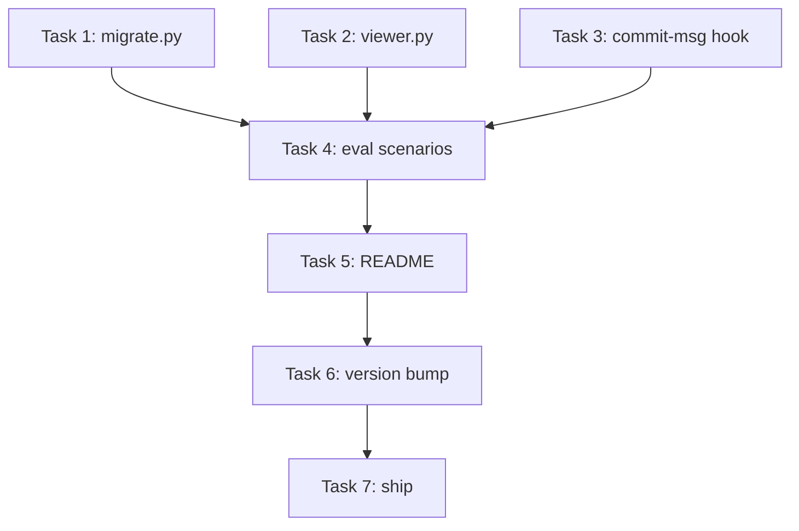

# Orchestra v1.2 — Implementation Plan

> **Doc ID:** 2026-05-06-orchestra-v1.2-implementation
> **Date:** 2026-05-06
> **DRI:** Hassan Mohiddin
> **Type:** Implementation Plan
> **Status:** Active
> **LLD:** `orchestra-dev/features/002-v1.2-migration-viewer-commit-msg.md`

## Header

**Goal:** Implement orchestra v1.2 per LLD-002 — solo↔team migration CLI + Tier 2 mermaid export + commit-msg hook. Ship in TDD vertical slices.

**Tech stack:** Python 3.14 (3.10+ lower bound), pytest, importlib path-loading for `extract_mermaid`, npx for mermaid render.

**LLD reference:** All design decisions in LLD-002. Plan does NOT re-state design.

## File Structure

```
orchestra/
├── cli/
│   ├── migrate.py                         # NEW (Task 1)
│   ├── viewer.py                          # NEW (Task 2)
│   └── install_hooks.py                   # MODIFIED (Task 3 — add --commit-msg + --all)
│   └── templates/
│       └── commit-msg.sh                  # NEW (Task 3)
├── tests/
│   ├── test_cli_migrate.py                # NEW (Task 1)
│   ├── test_cli_viewer.py                 # NEW (Task 2)
│   └── test_cli_install_hooks.py          # MODIFIED (Task 3 — extend coverage)
├── eval/scenarios/
│   ├── migrate-solo-to-team.json          # NEW (Task 4)
│   ├── mermaid-export.json                # NEW (Task 4)
│   └── commit-msg-hook.json               # NEW (Task 4)
├── README.md                              # MODIFIED (Task 5 — Tier 2 export section)
├── CHANGELOG.md                           # MODIFIED (Task 6 — v1.2.0 entry)
└── .claude-plugin/plugin.json             # MODIFIED (Task 6 — bump 1.1.0 → 1.2.0)
```

## Tasks

### Task 1: cli/migrate.py + tests **(IMPLEMENTED 2026-05-06 — orchestra commit `1f20dc6`)**

- **Files:** `cli/migrate.py` (NEW), `tests/test_cli_migrate.py` (NEW)
- **What:** Implement per LLD-002 § "`cli/migrate.py` — pseudocode" and § Security Considerations (atomic write via `.tmp` + `os.replace`). Reference, do not restate design.
- **Tests:**
  - `test_solo_to_team_flips_mode`
  - `test_solo_to_team_idempotent` (already team → no-op)
  - `test_solo_to_team_reports_missing_okr` (fixture: 2 ADRs, 1 missing)
  - `test_team_to_solo_reverse`
  - `test_dry_run_no_writes`
  - `test_atomic_write_no_partial_corruption` (interrupt mid-write via mocked rename failure)
- **Commit:** `feat: cli.migrate solo↔team mode flip + ADR scan. Refs: docs/features/002-v1.2-migration-viewer-commit-msg.md`

### Task 2: cli/viewer.py + tests

- **Files:** `cli/viewer.py` (NEW), `tests/test_cli_viewer.py` (NEW)
- **What:** Implement per LLD-002 § "`cli/viewer.py` — pseudocode". Reuses `_load_extract_mermaid()` pattern from `cli/lint.py:36-52`.
- **Tests:**
  - `test_render_doc_extracts_blocks` (mocked subprocess — assert npx called with right args)
  - `test_render_no_blocks_no_op` (file with no mermaid → empty result, exit 0)
  - `test_render_all_walks_docs` (fixture: 2 docs, 3 blocks total)
  - `test_render_npx_absent_exits_with_hint` (mocked `shutil.which("npx") = None`)
  - `test_render_appends_gitignore_first_run` (no `docs/.rendered/` in .gitignore → appended; second run → no double-append)
  - `test_render_continues_on_parse_error` (mocked subprocess returns nonzero for one block → continues with rest)
- **Commit:** `feat: cli.viewer Tier 2 mermaid export. Refs: docs/features/002-v1.2-migration-viewer-commit-msg.md`

### Task 3: install_hooks.py extension + commit-msg hook + tests

- **Files:** `cli/install_hooks.py` (MODIFIED), `cli/templates/commit-msg.sh` (NEW), `tests/test_cli_install_hooks.py` (extend)
- **What:** Implement per LLD-002 § "`commit-msg` hook — script content" and § API Changes table rows for `--commit-msg` / `--all` flags. Reuses `cli/install_hooks.py:36-58` idempotent diff-prompt pattern from v1.1.
- **Tests:**
  - `test_install_commit_msg_in_fresh_repo` (hook file written + executable)
  - `test_install_commit_msg_skip_in_non_git_repo`
  - `test_install_all_installs_both_hooks`
  - `test_commit_msg_hook_blocks_orphan_feat` (run hook script with mock `feat:` message, expect exit 1)
  - `test_commit_msg_hook_passes_chore` (run hook with `chore: x`, expect exit 0)
  - `test_commit_msg_hook_passes_feat_with_refs` (run hook with full body containing Refs:, expect exit 0)
- **Commit:** `feat: commit-msg hook for Refs: line check at message-author time. Refs: docs/features/002-v1.2-migration-viewer-commit-msg.md`

### Task 4: 3 eval scenarios

- **Files:**
  - `eval/scenarios/migrate-solo-to-team.json`
  - `eval/scenarios/mermaid-export.json`
  - `eval/scenarios/commit-msg-hook.json`
- **What:** End-to-end scenarios per LLD-002 Testing Strategy. Reuse the v1.1 eval framework patterns (cmd + setup + assert).
- **Tests:** `python -m eval.run --all` → 8/8 pass (5 v1.1 + 3 v1.2).
- **Commit:** `test: 3 eval scenarios for v1.2. Refs: docs/features/002-v1.2-migration-viewer-commit-msg.md`

### Task 5: README Tier 2 mermaid export

- **Files:** `README.md` (MODIFIED — extend "Viewing diagrams" section)
- **What:** Add Tier 2 row to viewing-diagrams table. Document `python -m cli.viewer render` invocation. Note the optional gitignore append behavior.
- **Tests:** Manual review.
- **Commit:** `docs: README Tier 2 mermaid export section. Refs: docs/features/002-v1.2-migration-viewer-commit-msg.md`

### Task 6: Version bump + CHANGELOG

- **Files:**
  - `.claude-plugin/plugin.json` (1.1.0 → 1.2.0)
  - `pyproject.toml` (1.1.0 → 1.2.0)
  - `CHANGELOG.md` (v1.2.0 entry)
- **Sequencing:** depends on Task 5 (README ready); blocks Task 7
- **Tests:** version strings match across 3 files; manual diff (no test code)
- **Commit:** `chore: bump version to 1.2.0`

### Task 7: LLD-002 status sync + ship (Gate 5)

Two sequenced commits per repo (rationale: doc-status update lands BEFORE the release-tag commit so the tagged commit reflects accurate doc state).

- **Files:**
  - `orchestra-dev/features/002-...md` (Status: Draft → Verified)
  - `orchestra-dev/design/orchestra-philosophy.md` (Changelog entry: v1.2 shipped)
  - `orchestra-dev/plans/2026-05-06-orchestra-v1.2-implementation.md` (Status: Active → Implemented)
- **Sequencing:** depends on Task 6
- **Tests:**
  - `python -m pytest tests/` all green
  - `python -m eval.run --all` 8/8
- **Commits (two, in order):**
  1. `docs: lld-002 verified, plan v1.2 implemented` (sync mirror first)
  2. `chore: tag v1.2.0 release` + `git tag v1.2.0` + `gh release create v1.2.0`

## Dependency Graph



Tasks 1, 2, 3 are independent and can be implemented in parallel.

## Test Strategy

- Unit + integration tests in `tests/` (existing pytest framework)
- Eval scenarios in `eval/scenarios/` (existing eval framework)
- Backward compat: all 53 v1.1 tests still pass

## Estimated Timeline

- ~~Task 1 (migrate): 1 day~~ → DONE 2026-05-06 (one session)
- Task 2 (viewer): 1 day
- Task 3 (commit-msg): 0.5 day
- Tasks 4-7 (evals + docs + ship): 1 day

**Total remaining:** ~2.5 days. Target ship: 2026-06-03 (per roadmap; on track).

## Changelog

| Date | Change |
|---|---|
| 2026-05-06 | Initial implementation plan drafted alongside LLD-002. Status: Active. |
| 2026-05-06 | Retroactive 4-gate spec review (initially skipped — Gate 3 violation). Iteration 1: 2/4 gates fail (Completeness — Task 6 structure + Task 1 stale state; Consistency — mild LLD-overlap in Task 1+2 What sections). Fixes applied: (1) Task 1 marked IMPLEMENTED with commit ref; (2) Task 1+2+3 What sections tightened to reference LLD instead of restating; (3) Task 6 gained Sequencing + Tests lines; (4) Task 7 two-commit rationale documented + commit order specified; (5) Timeline updated to reflect Task 1 done; (6) this changelog entry added. Status remains Active. |
