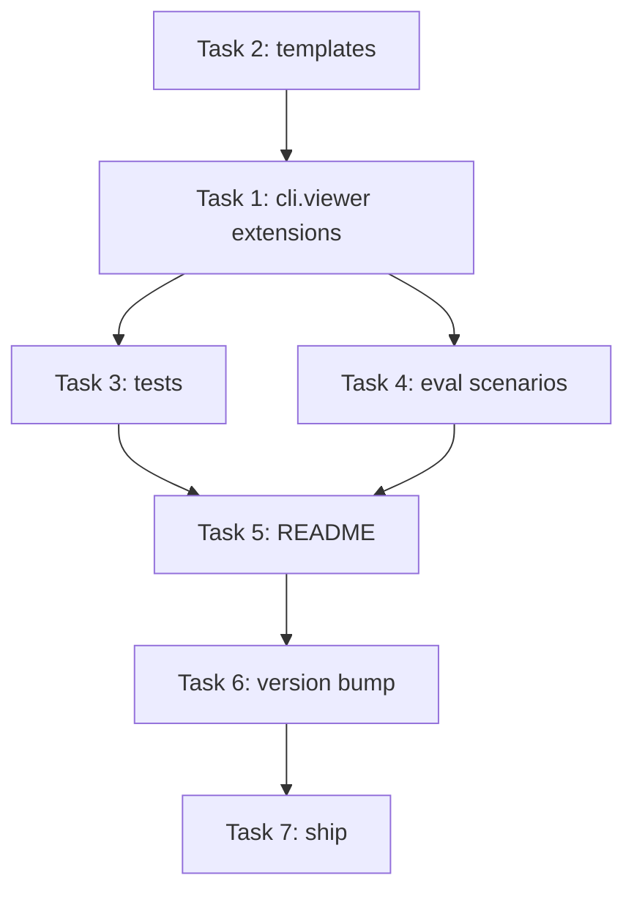

# Orchestra v1.3 — Implementation Plan

> **Doc ID:** 2026-05-06-orchestra-v1.3-implementation
> **Date:** 2026-05-06
> **DRI:** Hassan Mohiddin
> **Type:** Implementation Plan
> **Status:** Implemented
> **LLD:** `orchestra-dev/features/003-v1.3-doc-browser-mkdocs.md`

## Header

**Goal:** Implement orchestra v1.3 per LLD-003 — Tier 3 doc browser via MkDocs (Material). Ship in TDD vertical slices.

**Tech stack:** Python 3.14, pytest, mkdocs (user-installed via requirements-docs.txt template).

**LLD reference:** All design decisions in LLD-003. Plan does NOT re-state design.

## File Structure

```
orchestra/
├── cli/
│   ├── viewer.py                          # MODIFIED (Task 1) — add install_mkdocs, build_site, publish_gh_pages, InstallResult
│   └── templates/                         # NEW files (Task 2):
│       ├── mkdocs.yml
│       ├── docs-index.md
│       ├── requirements-docs.txt
│       └── mkdocs_hooks.py
├── tests/
│   └── test_cli_viewer.py                 # MODIFIED (Task 3) — extend with mkdocs install + build + publish tests
├── eval/scenarios/
│   ├── mkdocs-install.json                # NEW (Task 4)
│   └── mkdocs-build.json                  # NEW (Task 4)
├── README.md                              # MODIFIED (Task 5) — add Tier 3 row to Viewing Diagrams
├── CHANGELOG.md                           # MODIFIED (Task 6) — v1.3.0 entry
├── pyproject.toml                         # MODIFIED (Task 6) — bump 1.2.0 → 1.3.0
└── .claude-plugin/plugin.json             # MODIFIED (Task 6) — bump 1.2.0 → 1.3.0
```

## Tasks

### Task 1: cli.viewer extensions (install_mkdocs, build_site, publish_gh_pages, InstallResult)

- **Files:** `cli/viewer.py` (MODIFIED)
- **What:** Implement per LLD-003 § "`cli.viewer` extension" pseudocode. Reuses existing `_ensure_gitignore_rendered()` (cli/viewer.py:57-65) for `.gitignore` append.
- **Tests:** in Task 3 (combined test file edits — keeps test fixture imports in one place).
- **Sequencing:** depends on Task 2 (templates must exist before functions can read them at test time).
- **Commit:** `feat: cli.viewer install-mkdocs / build / publish-gh-pages. Refs: docs/features/003-v1.3-doc-browser-mkdocs.md`

### Task 2: cli/templates/ — 4 new template files

- **Files:**
  - `cli/templates/mkdocs.yml` — orchestra-flavored MkDocs config (Material theme + mermaid2 + tags + hooks)
  - `cli/templates/docs-index.md` — landing page template
  - `cli/templates/requirements-docs.txt` — pinned mkdocs/material/mermaid2 versions
  - `cli/templates/mkdocs_hooks.py` — status-tag synthesis hook
- **What:** Static templates per LLD-003 § "MkDocs Config Shape" + § "docs/index.md Template" + § "Filtering by Status".
- **Tests:** Templates loaded by Task 1's install_mkdocs, validated via Task 3 tests.
- **Sequencing:** independent (can run before or after Task 1; sequenced before Task 1 in dep graph for clarity).
- **Commit:** `feat: cli/templates/ for v1.3 mkdocs install. Refs: docs/features/003-v1.3-doc-browser-mkdocs.md`

### Task 3: tests/test_cli_viewer.py extensions

- **Files:** `tests/test_cli_viewer.py` (MODIFIED — append v1.3 tests)
- **What:** Per LLD-003 § Testing Strategy. Tests written in vertical-slice order: install_mkdocs fresh → idempotent → force →_mkdocs_available true/false → build_site error path → publish_gh_pages dirty-tree refusal.
- **Sequencing:** depends on Task 1 + Task 2.
- **Commit:** `test: cli.viewer mkdocs install / build / publish tests. Refs: docs/features/003-v1.3-doc-browser-mkdocs.md`

### Task 4: 2 new eval scenarios

- **Files:**
  - `eval/scenarios/mkdocs-install.json`
  - `eval/scenarios/mkdocs-build.json`
- **What:** Per LLD-003 § Testing Strategy § Eval scenarios.
  - `mkdocs-install` — install in fixture repo, verify all 4 files written + `.gitignore` contains `site/`
  - `mkdocs-build` — install + run `mkdocs build` (skip if mkdocs not on PATH; smoke-test only)
- **Sequencing:** depends on Task 1.
- **Commit:** `test: 2 v1.3 eval scenarios (mkdocs-install + mkdocs-build). Refs: docs/features/003-v1.3-doc-browser-mkdocs.md`

### Task 5: README Tier 3 row

- **Files:** `README.md` (MODIFIED — extend "Viewing diagrams" table with Tier 3 row)
- **What:** Document `python -m cli.viewer install-mkdocs` + `mkdocs serve` + GitHub Pages publish path. Note v1.3 vs v1.2 distinction (export = static images, browser = interactive site).
- **Sequencing:** depends on Task 4.
- **Commit:** `docs: README Tier 3 mkdocs browser section. Refs: docs/features/003-v1.3-doc-browser-mkdocs.md`

### Task 6: Version bump + CHANGELOG

- **Files:**
  - `.claude-plugin/plugin.json` (1.2.0 → 1.3.0)
  - `pyproject.toml` (1.2.0 → 1.3.0)
  - `CHANGELOG.md` (v1.3.0 entry)
- **Sequencing:** depends on Task 5.
- **Tests:** version strings match; manual diff.
- **Commit:** `chore: bump version to 1.3.0`

### Task 7: LLD-003 status sync + roadmap deviation log + ship (Gate 5)

Two sequenced commits per repo (Gate 5 first, then ship tag).

- **Files:**
  - `orchestra-dev/features/003-...md` (Status: Draft → Verified)
  - `orchestra-dev/design/orchestra-philosophy.md` (Changelog entry: v1.3 shipped)
  - `orchestra-dev/plans/2026-05-06-orchestra-v1.3-implementation.md` (Status: Active → Implemented)
  - `orchestra-dev/plans/2026-05-06-orchestra-roadmap.md` (deviation entry: v1.3 row updated to record actual scope vs original — DECISIONS.md auto-rebuild deferred, no `serve` command, eval 1→2)
- **Sequencing:** depends on Task 6.
- **Tests:**
  - `python -m pytest tests/` all green (≥84 total)
  - `python -m eval.run --all` 10/10 (8 v1.2 + 2 v1.3)
- **Commits (two, in order):**
  1. `docs: lld-003 verified, plan v1.3 implemented, roadmap deviation log` (sync mirror first)
  2. `chore: tag v1.3.0 release` + `git tag v1.3.0` + `gh release create v1.3.0`

## Dependency Graph



## Test Strategy

Per LLD-003 § Testing Strategy. Pytest + eval framework reused from v1.2.

## Commit Message Template

Per `.claude/rules/commit-strategy.md`. `<type>` ∈ {feat, fix, refactor, test, docs, chore}.

## Estimated Timeline

- Task 1+2 (cli.viewer + templates): 1 day
- Task 3+4 (tests + eval): 0.5 day
- Tasks 5-7 (README + version + ship): 0.5 day

**Total:** ~2 days. Target ship: 2026-06-24 (per roadmap; on track if v1.2 already shipped).

## Changelog

| Date | Change |
|---|---|
| 2026-05-06 | Initial implementation plan drafted alongside LLD-003. Status: Active. |
| 2026-05-06 | Iteration 1 spec review — 4/4 gates pass. 2 minor fixes applied: (1) pyproject.toml added to File Structure (was modified in Task 6 but missing from tree); (2) Task 3 test enumeration replaced with vertical-slice ordering reference to LLD-003 (was restating design content). Status remains Active. |
| 2026-05-06 | All 7 tasks implemented. v1.3.0 shipped. 85 pytest + 10/10 eval. Status: Implemented. |
